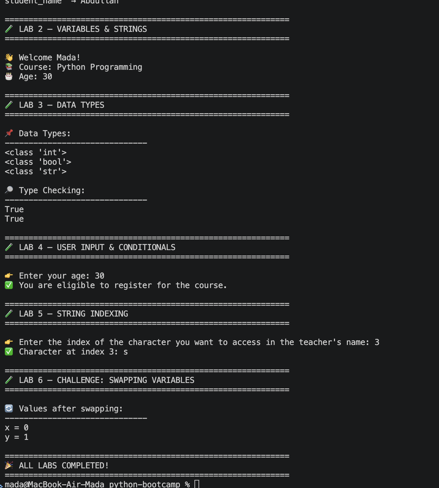

# 🐍 Week 2 — Day 2

## Python Fundamentals & Problem Solving

> A practical session focused on Python variables, data types, user input, conditionals, string indexing, and variable swapping.

---

## 📚 What We Learned

During **Day 2 of Week 2**, we continued building our Python fundamentals by working with variables and learning how Python handles different types of data.

The labs focused on understanding how to **store information, inspect data, receive input from users, make decisions, access characters in strings, and manipulate values**.

---

## 🧪 Labs

### 🔹 Lab 1 — Variables & Case Sensitivity

We learned that Python variable names are **case-sensitive**.

For example:

```python
Student_name = "Sara"
student_name = "Abdullah"
```

Although the names look very similar, Python treats them as **two different variables**.

#### 💡 Key takeaway

* Variable names are case-sensitive.
* `Student_name` and `student_name` are different variables.
* Consistent naming is important when writing clean and maintainable code.

---

### 🔹 Lab 2 — Variables & String Formatting

We created variables to store information about a student and a course:

```python
student_name = "Mada"
student_age = 30
course = "Python Programming"
```

We then used an **f-string** to insert the student's name into a message.

#### 💡 Key takeaway

We learned how to:

* Store information inside variables.
* Work with strings and numbers.
* Insert variables into strings using **f-strings**.
* Create more meaningful and readable output.

---

### 🔹 Lab 3 — Data Types & Type Checking

We explored Python's built-in data types:

```text
str   → String
int   → Integer
bool  → Boolean
```

We also used:

```python
type()
```

to identify the type of a value and:

```python
isinstance()
```

to check whether a value belongs to a specific type.

#### 💡 Key takeaway

We learned how to:

* Identify the type of a variable.
* Understand the difference between `str`, `int`, and `bool`.
* Check data types using `type()`.
* Verify types using `isinstance()`.

---

### 🔹 Lab 4 — User Input & Conditional Statements

We learned how to receive information from the user using:

```python
input()
```

We then used an `if` statement to make a decision based on the entered value.

#### 💡 Key takeaway

This lab introduced an important programming concept:

> **Programs can receive information and make decisions based on that information.**

We practiced:

* Getting user input.
* Converting input into an integer.
* Using `if` and `else`.
* Producing different output depending on a condition.

---

### 🔹 Lab 5 — String Indexing

We worked with a teacher's name and allowed the user to select a character by its index.

```python
teacher_name = "Faisal"
```

We learned that Python strings use **zero-based indexing**.

For example:

```text
F a i s a l
0 1 2 3 4 5
```

#### 💡 Key takeaway

We learned how to:

* Access individual characters in a string.
* Understand zero-based indexing.
* Check whether an index is valid.
* Handle invalid input with a conditional statement.

---

### 🔹 Lab 6 — Challenge: Swapping Variables

The final challenge focused on **swapping the values of two variables**.

Initially:

```text
x = 1
y = 0
```

After swapping:

```text
x = 0
y = 1
```

We used Python's ability to assign multiple values at once.

#### 💡 Key takeaway

We learned that Python allows us to swap variables without needing an additional temporary variable.

This is a useful example of Python's simple and expressive syntax.

---

## 🧠 Skills Practiced

By the end of Day 2, we practiced:

| Concept             | What We Practiced                   |
| ------------------- | ----------------------------------- |
| 📦 Variables        | Storing and using data              |
| 🔤 Case Sensitivity | Understanding variable naming       |
| 📝 Strings          | Working with text                   |
| 🔢 Integers         | Working with numbers                |
| ✅ Booleans          | Representing `True` / `False`       |
| 🔍 `type()`         | Identifying data types              |
| 🔎 `isinstance()`   | Checking data types                 |
| ⌨️ `input()`        | Receiving user input                |
| 🔀 Conditionals     | Making decisions with `if` / `else` |
| 🔤 Indexing         | Accessing characters in strings     |
| 🔄 Assignment       | Swapping variable values            |

---

## 📸 Output

The following screenshot shows the terminal output produced while running the Day 2 labs.

<p align="center">
  
</p>

---

## 🎯 Day 2 Takeaway

The main goal of this session was to move from simply **writing Python statements** to understanding how a program can **store information, inspect it, interact with users, and make decisions**.

> **Variables → Data Types → Input → Conditions → String Operations → Problem Solving**

These concepts form an important foundation for the more advanced Python and Django topics coming later in the bootcamp.

---

<div align="center">

### 🐍 Week 2 • Day 2

**Learn → Practice → Understand → Build**

</div>
