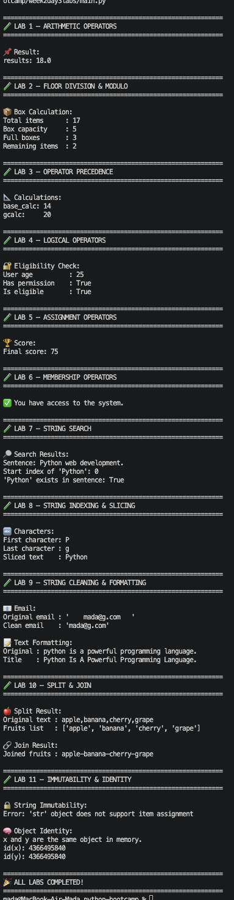

# 🐍 Week 2 — Day 3

## Python Operators, Strings & Problem Solving

> Day 3 focused on strengthening Python fundamentals through arithmetic operations, logical expressions, string manipulation, collections, and object identity.

---

## 📚 What We Learned

During **Day 3 of Week 2**, we explored several important Python concepts that help us write more powerful and expressive programs.

We moved beyond basic variables and learned how to **perform calculations, compare values, make decisions, search and manipulate strings, and work with lists**.

---

## 🧪 Labs

### 🔢 Lab 1 — Arithmetic Operators

We practiced Python's basic arithmetic operators and learned how Python evaluates mathematical expressions.

We worked with:

* `+` Addition
* `-` Subtraction
* `*` Multiplication
* `/` Division

We also practiced how **operator precedence** affects the result of an expression.

---

### 📦 Lab 2 — Floor Division & Modulo

We learned two useful Python operators:

```text
//  → Floor division
%   → Modulo / remainder
```

Using these operators, we calculated how many complete boxes could be filled and how many items would remain.

#### 💡 Key takeaway

* `//` gives the number of complete groups.
* `%` gives the remaining amount after division.

---

### 📐 Lab 3 — Operator Precedence

We explored how Python determines the order in which an expression is evaluated.

We practiced using:

```text
()
**
*
/
+
-
```

We also compared expressions with and without parentheses to understand how parentheses can change the result.

#### 💡 Key takeaway

> Parentheses can be used to control the order of operations and make calculations clearer.

---

### 🔐 Lab 4 — Logical Operators

We used the `and` operator to combine multiple conditions.

In this exercise, eligibility depended on:

* The user's age.
* Whether the user had permission.

The conditions produced a Boolean result:

```text
True / False
```

#### 💡 Key takeaway

Logical operators allow us to combine conditions and make more meaningful decisions in our programs.

---

### 🏆 Lab 5 — Assignment Operators

We practiced shorthand assignment operators:

```python
+=
*=
```

These operators allow us to update the value of a variable without writing the complete expression again.

#### 💡 Key takeaway

Assignment operators make code shorter and easier to read when updating values.

---

### 👤 Lab 6 — Membership Operators

We worked with a list of memberships:

```text
Admin
Moderator
Member
```

We then used the `in` operator to check whether the current membership existed in the list.

#### 💡 Key takeaway

The `in` operator can be used to check whether a value exists inside a collection such as a list or string.

---

### 🔎 Lab 7 — String Search

We learned how to search for text inside a string using:

```python
.find()
```

The `.find()` method returns the starting index of the searched text.

We also used:

```python
in
```

to check whether a word exists inside a sentence.

#### 💡 Key takeaway

* `.find()` → returns the position of the text.
* `in` → returns `True` or `False`.

---

### 🔤 Lab 8 — String Indexing & Slicing

We practiced accessing individual characters using indexes.

For example:

```text
P y t h o n
0 1 2 3 4 5
```

We also practiced **string slicing** to extract part of a string.

```python
message[0:6]
```

#### 💡 Key takeaway

Strings can be accessed character by character using indexes and can be extracted in sections using slicing.

---

### 🧹 Lab 9 — String Cleaning & Formatting

We practiced several useful string methods:

```python
.strip()
.lower()
.title()
```

We used `.strip()` to remove unnecessary spaces and `.lower()` to normalize an email address.

We also used `.title()` to format a sentence.

#### 💡 Key takeaway

String methods are useful for **cleaning, formatting, and preparing user input** before processing it.

---

### 🍎 Lab 10 — Split & Join

We learned how to convert a string into a list using:

```python
.split()
```

and how to combine list items into a string using:

```python
.join()
```

For example:

```text
apple,banana,cherry,grape
```

can be split into:

```text
['apple', 'banana', 'cherry', 'grape']
```

and then joined into:

```text
apple-banana-cherry-grape
```

#### 💡 Key takeaway

`split()` and `join()` are especially useful when processing structured text and data.

---

### 🔒 Lab 11 — String Immutability & Object Identity

This lab introduced two important Python concepts.

#### 🔒 String Immutability

We attempted to change a character inside a string.

Python raised a `TypeError` because **strings are immutable**.

This means that once a string is created, its individual characters cannot be changed directly.

#### 🧠 Object Identity

We also explored:

```python
is
```

and:

```python
id()
```

The `is` operator checks whether two variables refer to the **same object**, while `id()` returns the identity of an object.

#### 💡 Key takeaway

We learned the difference between **changing a value** and checking whether two variables refer to the **same object in memory**.

---

## 🧠 Concepts Practiced

| Concept                | What We Learned                    |
| ---------------------- | ---------------------------------- |
| ➕ Arithmetic Operators | Performing calculations            |
| `//`                   | Floor division                     |
| `%`                    | Finding remainders                 |
| 🧮 Operator Precedence | Controlling calculation order      |
| `and`                  | Combining conditions               |
| `+=`, `*=`             | Updating variables                 |
| `in`                   | Checking membership                |
| `.find()`              | Finding text positions             |
| 🔤 Indexing            | Accessing characters               |
| ✂️ Slicing             | Extracting parts of strings        |
| `.strip()`             | Removing surrounding whitespace    |
| `.lower()`             | Converting text to lowercase       |
| `.title()`             | Formatting text                    |
| `.split()`             | Converting strings into lists      |
| `.join()`              | Combining list items               |
| 🔒 Immutability        | Understanding unchangeable strings |
| `is`                   | Checking object identity           |
| `id()`                 | Inspecting object identity         |

---

## 📸 Terminal Output

The following screenshot shows the output generated while running the **Week 2 — Day 3** labs.

<p align="center">
  
</p>

---

## 🎯 Day 3 Takeaway

Day 3 helped us move from basic Python syntax toward **practical problem solving and data manipulation**.

Throughout the labs, we practiced how to:

> **Calculate → Compare → Decide → Search → Manipulate → Process**

These concepts provide an important foundation for writing real Python programs and will become increasingly useful as we move toward **Django, databases, forms, authentication, and web application development**.

---

<div align="center">

### 🐍 Week 2 • Day 3

**Learn • Practice • Understand • Build**

</div>
