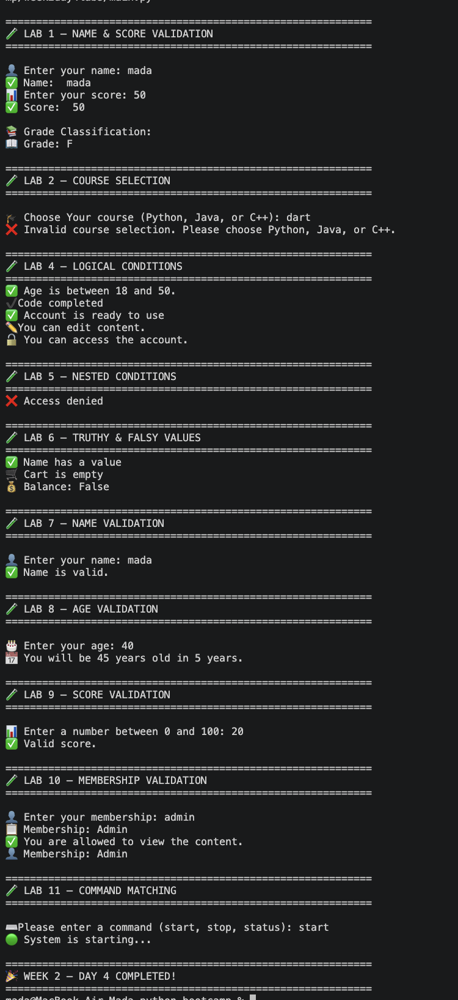

# 🐍 Week 2 — Day 4

## Python Conditionals, Validation & Pattern Matching

> Day 4 focused on making Python programs smarter by validating user input, combining conditions, handling different cases, and working with truthy and falsy values.

---

## 📚 What We Learned

During **Day 4 of Week 2**, we continued working with Python conditional statements and learned how programs can make decisions based on different types of input.

The labs focused on **input validation, comparison operators, logical operators, nested conditions, truthy/falsy values, string validation, membership checking, and `match/case` statements**.

---

## 🧪 Labs

### 👤 Lab 1 — Name & Score Validation

We practiced validating user input before using it.

The program checks whether:

* A name was entered.
* The score contains digits.
* The score is between `0` and `100`.

We also used `.isdigit()` to check whether the score contains numeric characters.

#### 💡 Key takeaway

> User input should be validated before the program relies on it.

---

### 🎓 Lab 2 — Course Selection

We used Python's `match/case` statement to handle different course selections.

The user can select:

```text
Python
Java
C++
```

The input is converted to uppercase before matching.

#### 💡 Key takeaway

`match/case` provides a clean way to handle multiple possible values.

---

### 🏆 Lab 3 — Grade Classification

We used `if`, `elif`, and `else` to determine a student's grade based on their score.

The program checks the score from the highest range to the lowest:

```text
90+  → A
80+  → B
70+  → C
60+  → D
<60  → F
```

#### 💡 Key takeaway

We learned how multiple conditions can be evaluated in sequence to classify a value.

---

### 🔐 Lab 4 — Logical Conditions

We practiced combining multiple conditions using logical operators.

We worked with:

```python
and
or
not
```

Examples included checking:

* Whether an account is active **and** verified.
* Whether a user is an admin **or** moderator.
* Whether an account is **not** blocked.

#### 💡 Key takeaway

Logical operators allow us to combine conditions and create more realistic decision-making in programs.

---

### 🔀 Lab 5 — Nested Conditions

We practiced putting one `if` statement inside another.

The program first checks whether an account is active and then checks whether the user has permission.

```text
Account active?
      │
      ├── Yes → Has permission?
      │              ├── Yes → Access granted
      │              └── No  → Access denied
      │
      └── No → Account inactive
```

#### 💡 Key takeaway

Nested conditions are useful when one decision depends on the result of another decision.

---

### 🛒 Lab 6 — Truthy & Falsy Values

We explored how Python treats certain values as `True` or `False` when used in conditions.

For example:

```python
cart = []
balance = 0
```

An empty list and `0` are considered **falsy** values.

We also used:

```python
bool(balance)
```

to explicitly convert a value into a Boolean.

#### 💡 Key takeaway

Python allows many values to be evaluated directly in conditions without explicitly writing `True` or `False`.

---

### ✍️ Lab 7 — Name Validation

We created a more complete name validation process.

The program checks whether:

1. A name was provided.
2. The name contains only letters and spaces.
3. The name is valid.

We practiced:

```python
.strip()
.replace()
.isalpha()
```

#### 💡 Key takeaway

We learned how multiple string methods can work together to validate user input.

---

### 🎂 Lab 8 — Age Validation

We validated an age entered by the user.

The program:

1. Removes unnecessary whitespace.
2. Checks whether the input contains digits.
3. Converts the input into an integer.
4. Uses the number to calculate the user's age in five years.

#### 💡 Key takeaway

Input received from `input()` is a string, so it often needs to be validated and converted before performing numerical operations.

---

### 📊 Lab 9 — Score Validation

We practiced validating a score using two conditions.

The score must:

* Contain digits.
* Be between `0` and `100`.

This reinforced the importance of combining **input validation and conditional logic**.

---

### 👤 Lab 10 — Membership Validation

We worked with a list of valid memberships:

```text
Admin
Viewer
Editor
```

The user's input is cleaned and normalized before checking whether it exists in the list.

We practiced:

```python
.strip()
.lower()
.title()
in
```

#### 💡 Key takeaway

Cleaning and normalizing user input makes it easier to compare input reliably against existing data.

---

### ⌨️ Lab 11 — Command Matching

The final lab used `match/case` to create a simple command system.

The available commands were:

```text
start
stop
status
```

Each command produces a different response.

#### 💡 Key takeaway

`match/case` can make command-based programs easier to organize and understand when there are several possible choices.

---

## 🧠 Concepts Practiced

| Concept          | What We Learned                  |
| ---------------- | -------------------------------- |
| `if`             | Making decisions                 |
| `elif`           | Checking additional conditions   |
| `else`           | Handling alternative cases       |
| `and`            | Combining conditions             |
| `or`             | Allowing alternative conditions  |
| `not`            | Reversing a Boolean condition    |
| Nested `if`      | Decisions inside decisions       |
| `match/case`     | Matching different values        |
| `.isdigit()`     | Checking numeric input           |
| `.isalpha()`     | Checking alphabetic input        |
| `.strip()`       | Removing surrounding whitespace  |
| `.replace()`     | Replacing characters/text        |
| `.lower()`       | Normalizing text                 |
| `.title()`       | Formatting text                  |
| `in`             | Checking membership              |
| `bool()`         | Converting values to Boolean     |
| Truthy/Falsy     | Understanding Boolean evaluation |
| Input validation | Checking user-provided data      |

---

## 🎯 Day 4 Takeaway

Day 4 focused on an important step in programming:

> **Teaching the program how to make decisions.**

We learned how to take user input, validate it, compare it against rules, and produce different results depending on the situation.

The overall progression was:

```text
👤 User Input
      ↓
🧹 Clean the Input
      ↓
🔍 Validate the Input
      ↓
🧠 Apply Conditions
      ↓
🔀 Choose an Outcome
      ↓
📤 Display a Result
```

These concepts are fundamental to building real applications because web applications constantly need to **validate users, check permissions, process forms, and respond differently to different situations**.

---

## 📸 Terminal Output

The screenshot below shows the terminal output from the **Week 2 — Day 4** labs.

<p align="center">
  
</p>

---

<div align="center">

### 🐍 Week 2 • Day 4

**Learn → Validate → Decide → Build**

</div>
