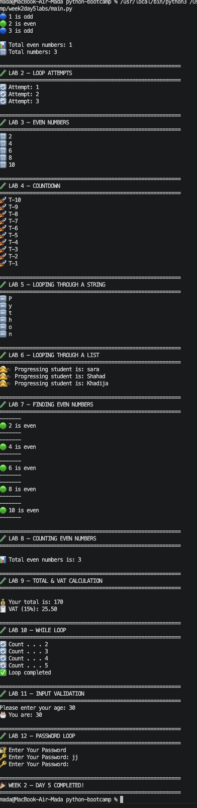

# 🐍 Week 2 — Day 5

## Python Loops & Repetition

> Day 5 focused on repetition in Python using `for` loops and `while` loops, along with `range()`, counters, iteration over strings and lists, and input validation.

---

## 📚 What We Learned

During **Day 5 of Week 2**, we learned how to make Python repeat instructions efficiently.

Instead of writing the same code multiple times, loops allow us to execute a block of code repeatedly based on a range, collection, condition, or user input.

The labs introduced both major types of loops in Python:

```text
🔁 for loop
🔄 while loop
```

---

## 🧪 Labs

### 🔢 Lab 1 — Even & Odd Numbers

We used a `for` loop with `range()` to go through a sequence of numbers.

We also used the modulo operator `%` to determine whether each number was even or odd.

```text
number % 2 == 0
```

We created a counter to keep track of the total number of even values.

#### 💡 Key takeaway

Loops allow us to process a sequence of numbers without repeating the same code manually.

---

### 🔄 Lab 2 — Loop Attempts

We used:

```python
range(3)
```

to repeat an operation three times.

We also used `number + 1` to display human-friendly attempt numbers starting from `1`.

#### 💡 Key takeaway

`range()` is commonly used with `for` loops to control how many times something should repeat.

---

### 🔢 Lab 3 — Even Numbers Using `range()`

We explored the three arguments of `range()`:

```python
range(start, stop, step)
```

The loop:

```python
range(2, 11, 2)
```

produces even numbers by increasing the value by `2` each time.

#### 💡 Key takeaway

The `step` argument allows us to control how quickly a sequence changes.

---

### 🚀 Lab 4 — Countdown

We used a negative step to count backwards:

```python
range(10, 0, -1)
```

This allowed us to create a countdown from `10` to `1`.

#### 💡 Key takeaway

A `for` loop doesn't have to count upward. Using a negative step allows us to iterate backwards.

---

### 🔤 Lab 5 — Looping Through a String

We used a `for` loop to iterate through each character in:

```text
Python
```

Each character was printed separately.

#### 💡 Key takeaway

Strings are iterable, meaning we can loop through their characters one by one.

---

### 👩‍🎓 Lab 6 — Looping Through a List

We used a list containing student names and looped through each student.

```python
students = ["sara", "Shahad", "Khadija"]
```

#### 💡 Key takeaway

Lists are also iterable, allowing us to process each item individually.

This is especially important when working with collections of data.

---

### 🔎 Lab 7 — Finding Even Numbers

We combined a loop with a conditional statement.

The loop went through numbers from `1` to `10`, while the `if` statement checked whether each number was even.

#### 💡 Key takeaway

Loops and conditions can work together:

```text
🔁 Repeat
   ↓
🔍 Check condition
   ↓
📤 Perform action
```

This pattern is used frequently in real programs.

---

### 📊 Lab 8 — Counting Even Numbers

We used a counter variable:

```python
even_counter = 0
```

Every time an even number was found, the counter increased.

```python
even_counter += 1
```

#### 💡 Key takeaway

Counters are useful when we need to count how many items satisfy a particular condition.

---

### 💰 Lab 9 — Calculating Total & VAT

We looped through a list of prices and accumulated their values into a total.

```python
total += price
```

We then calculated **15% VAT** from the total.

#### 💡 Key takeaway

Loops can be used to process numerical data and calculate totals from collections.

This is a common pattern in applications such as shopping carts and invoices.

---

### 🔄 Lab 10 — While Loop

We introduced the `while` loop.

Unlike a `for` loop, which is often used to iterate over a known sequence, a `while` loop continues running while its condition remains `True`.

```text
count < 5
```

The loop continues until the condition becomes false.

#### 💡 Key takeaway

A `while` loop is useful when the number of repetitions depends on a condition.

---

### ⌨️ Lab 11 — Input Validation with `while`

We used a `while` loop to repeatedly ask the user for their age until a valid numeric value was entered.

We used:

```python
.isdigit()
```

to validate the input.

#### 💡 Key takeaway

A `while` loop is particularly useful for **input validation**, because we don't always know how many attempts a user will need.

```text
User Input
    ↓
Valid?
 ┌──┴──┐
No    Yes
 ↓      ↓
Ask    Continue
again
```

---

### 🔐 Lab 12 — Password Loop

The final exercise introduced a loop that continues asking for input while the password variable is not empty.

This exercise reinforced the concept of using a `while` loop with a condition controlled by user input.

#### 💡 Key takeaway

The condition of a `while` loop can depend on values that change during the execution of the program.

---

## 🧠 Concepts Practiced

| Concept             | What We Learned                           |
| ------------------- | ----------------------------------------- |
| 🔁 `for` loop       | Repeating code over a sequence            |
| 🔄 `while` loop     | Repeating code while a condition is true  |
| `range()`           | Generating number sequences               |
| `start`             | Choosing where a range begins             |
| `stop`              | Choosing where a range ends               |
| `step`              | Controlling the increment/decrement       |
| `%`                 | Checking even and odd numbers             |
| `+=`                | Updating counters and totals              |
| 🔢 Counters         | Counting matching values                  |
| 🔤 Iteration        | Processing strings character by character |
| 📋 Lists            | Processing collections of values          |
| ⌨️ Input validation | Repeatedly checking user input            |
| 🔍 Conditions       | Controlling when code executes            |

---

## 🔁 The Main Idea of Day 5

The biggest concept we learned today was **iteration**.

Instead of doing this:

```text
Print item 1
Print item 2
Print item 3
Print item 4
...
```

we can tell Python:

```text
🔁 "Repeat this operation for every item."
```

This makes our programs:

* Cleaner
* Shorter
* More flexible
* Easier to maintain

---

## 📸 Terminal Output

The screenshot below shows the terminal output from the **Week 2 — Day 5** labs.

<p align="center">
  
</p>

---

## 🎯 Day 5 Takeaway

Day 5 introduced one of the most important programming concepts: **loops**.

We learned how to use repetition to process numbers, strings, lists, calculations, and user input.

The progression of the day was:

```text
🔢 Numbers
   ↓
🔁 for Loops
   ↓
📋 Lists & Strings
   ↓
📊 Counters & Calculations
   ↓
🔄 while Loops
   ↓
⌨️ Input Validation
```

These concepts are essential for building more advanced Python applications because real programs frequently need to **process collections of data, repeat operations, validate input, and perform calculations**.

---

<div align="center">

### 🐍 Week 2 • Day 5

**Iterate • Repeat • Process • Build**

</div>
