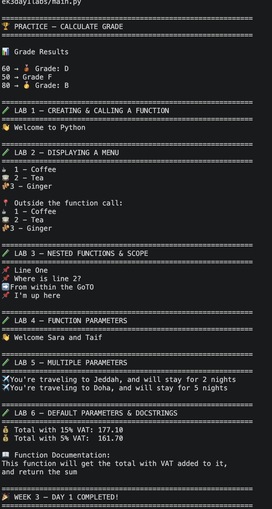

# 🐍 Week 3 — Day 2

## Python Modules, Scope & Namespaces

> Day 2 focused on understanding how Python organizes code and manages variables and functions through **modules, namespaces, scope, global variables, local variables, and function calls**.

---

## 📚 What We Learned

Today we moved beyond simply creating functions and started learning **where Python stores names and how it finds them**.

The main concepts covered were:

```text
📦 Modules
📥 Imports
🌍 Global Scope
📍 Local Scope
🔎 globals()
🔎 locals()
🪆 Nested Functions
🔗 Function Call Chains
🧠 Namespaces
```

---

## 🧪 Practice — Importing a Function

We started by importing `calculate_grade()` from our separate `grades.py` module:

```python
from grades import calculate_grade
```

Our project now has separate files:

```text
📁 Project
│
├── 📄 main.py
│
└── 📄 grades.py
    └── calculate_grade()
```

### 💡 What we learned

A module allows us to store reusable Python code in a separate file.

`main.py` can import functionality from `grades.py` instead of rewriting the function.

```text
grades.py
    │
    └── calculate_grade()
             ↓
          import
             ↓
main.py
    │
    └── calculate_grade()
```

---

## 🧪 Lab 1 — Variables & Function Names

We created variables for the bootcamp:

```python
course = "Web Development Bootcamp"
duration = 12
```

We also created a function named `type()`.

This demonstrates an important Python concept: **names can refer to different objects**, and defining our own name can affect what Python finds when that name is used.

### 💡 Key takeaway

Python resolves names based on the namespaces available to it.

The name:

```text
type
```

normally refers to Python's built-in `type()` function.

By defining our own `type()` function, we created another object with that name in our current namespace.

This is an important example of why choosing clear, non-conflicting names matters.

---

## 🧪 Lab 2 — `globals()` & Global Namespace

We created global variables:

```python
building = "Tuwaiq Academy"
cohort_size = 20
```

Then we explored:

```python
globals()
```

### 🌍 What is `globals()`?

`globals()` returns a dictionary representing the current **global namespace**.

We can use it to inspect names available at the global level.

For example:

```python
globals()["building"]
```

accesses the value associated with the name `"building"`.

### 💡 Key takeaway

Python stores global names in a namespace that can be inspected using `globals()`.

```text
Global Namespace
│
├── building
├── cohort_size
├── functions
├── imported names
└── other global objects
```

---

## 🧪 Lab 3 — Local Scope & Nested Functions

We explored different values of the same variable name:

```python
location = "Globl"
```

Inside `outter()`:

```python
location = "Outter"
```

And inside `inner()`:

```python
location = "Inner"
```

Each function has its own local scope.

### 💡 What we learned

The same variable name can exist in different scopes.

```text
🌍 Global
location = "Globl"

      ↓

📍 outter()
location = "Outter"

      ↓

📍 inner()
location = "Inner"
```

Python uses the name that is available in the current scope.

This introduced the idea that **where a variable is defined matters**.

---

## 🧪 Lab 4 — Function Call Chain

We created several functions that call one another:

```text
country()
   ↓
city()
   ↓
house()
   ↓
room()
   ↓
desk()
   ↓
printer()
```

Calling:

```python
country()
```

starts the entire chain.

### 💡 What we learned

Functions can call other functions.

This creates a **call chain**.

Python keeps track of these active function calls while the program is running.

Conceptually:

```text
country()
   │
   └── city()
        │
        └── house()
             │
             └── room()
                  │
                  └── desk()
                       │
                       └── printer()
```

This concept becomes very important when debugging programs and understanding the call stack.

---

## 🧪 Lab 5 — Local vs Global Variables

We created:

```python
language = "Python"
```

Then created a function with a parameter using the same name:

```python
def show_lang(language):
```

We called:

```python
show_lang("Dart")
```

Inside the function, the value is:

```text
Dart
```

But outside the function, the global value remains:

```text
Python
```

### 💡 Key takeaway

The function parameter is local to the function.

```text
🌍 Global
language = "Python"

        ↓

📍 show_lang()
language = "Dart"
```

The local parameter does not replace the global variable.

---

## 🧪 Lab 6 — Using a Global Variable

We created a global VAT rate:

```python
rate = 0.15
```

The function `getTotal()` uses that variable when calculating the total.

```python
total = amount * rate + amount
```

### 💡 What we learned

A function can access a global variable when it doesn't have a local variable with the same name.

The function uses:

```text
rate → 0.15
```

from the global namespace.

### ⚠️ Important concept

Although global variables can be accessed from functions, relying heavily on global state can make larger programs harder to understand.

This exercise helps us understand **how scope works**.

---

## 🧪 Lab 7 — `locals()` & Local Namespace

The final lab introduced:

```python
locals()
```

Inside `inspect_order()` we created:

```python
item
qty
subtotal
```

These are local names belonging to the function.

`locals()` lets us inspect the current local namespace.

### Example

```python
locals()["subtotal"]
```

accesses the value of `subtotal` through the dictionary returned by `locals()`.

The function therefore gives us a look at the variables currently available inside its local scope.

---

## 🌍 `globals()` vs 📍 `locals()`

One of the most important comparisons from today:

| Function    | What it shows           |
| ----------- | ----------------------- |
| `globals()` | Global namespace        |
| `locals()`  | Current local namespace |

Think of it like this:

```text
             🐍 Python
                 │
        ┌────────┴────────┐
        ↓                 ↓
   🌍 globals()       📍 locals()
        │                 │
   Global names       Local names
```

---

## 🧠 Concepts Practiced

| Concept             | What We Learned                     |
| ------------------- | ----------------------------------- |
| 📦 Modules          | Organizing code into separate files |
| 📥 `import`         | Bringing code from another module   |
| 🌍 Global scope     | Names available globally            |
| 📍 Local scope      | Names belonging to a function       |
| `globals()`         | Inspecting the global namespace     |
| `locals()`          | Inspecting the local namespace      |
| 🪆 Nested functions | Functions inside functions          |
| 🔗 Call chain       | Functions calling other functions   |
| 🧠 Namespace        | Where Python keeps names            |
| 🔍 Name resolution  | How Python finds a name             |

---

## 🔬 Scope Visualization

A useful way to understand today's lesson:

```text
                    🌍 GLOBAL SCOPE
                         │
             ┌───────────┼───────────┐
             │           │           │
          course      building     rate
             │
             │
             ▼
       📍 FUNCTION SCOPE
             │
       ┌─────┴─────┐
       │           │
     outter()    getTotal()
       │
       ▼
    inner()
```

Each function can have its own local names while still being able to access names from appropriate outer scopes.

---

## 🎯 Day 2 Takeaway

Today we learned that Python isn't just executing lines of code randomly. It keeps track of **names, scopes, namespaces, and function calls**.

The progression was:

```text
📦 Modules
   ↓
📥 Import Functions
   ↓
🌍 Global Namespace
   ↓
📍 Local Scope
   ↓
🪆 Nested Functions
   ↓
🔗 Function Call Chains
   ↓
🔎 globals() / locals()
```

The main lesson:

> **Understanding scope and namespaces helps us understand where Python finds variables and functions — and why the same name can have different meanings in different places.**

These concepts form an important foundation for writing larger, modular Python applications.

---

## 📸 Terminal Output

The terminal output demonstrates the module import, global namespace inspection, nested scopes, function call chains, global/local variables, and local namespace inspection from **Week 3 — Day 2**.

<p align="center">
  
</p>

---

<div align="center">

### 🐍 WEEK 3 • DAY 2

**Import • Scope • Namespace • Understand**

</div>
