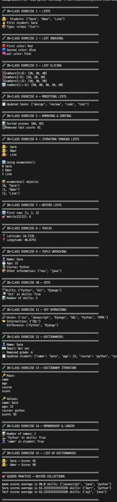
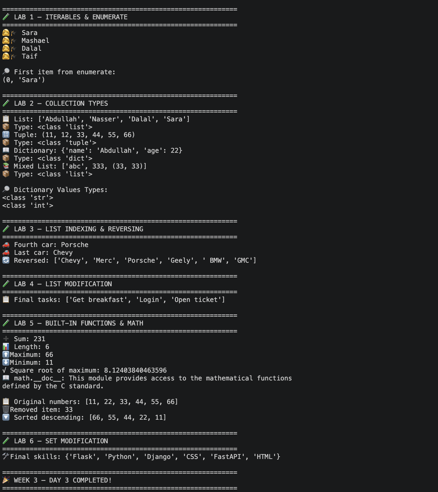

# 🐍 Week 3 — Day 3

## Python Collections

> Day 3 focused on Python's core collection data structures and how to store, access, modify, search, and iterate through groups of data.

---

## 📚 What We Learned

Today we worked with four important Python collection types:

```text
📋 Lists
📦 Tuples
🔵 Sets
📖 Dictionaries
````

We also practiced:

```text
🔢 Indexing
✂️ Slicing
🔄 Iteration
➕ Adding items
🗑️ Removing items
🔎 Membership testing
📊 Built-in functions
🧩 Nested collections
📦 enumerate()
🔢 Unpacking
📐 math module
```

---

# 🧪 Exercises & Guided Practice



The first part of the session focused on understanding Python's built-in collection structures through exercises and guided practice.

---

# 📋 Lists

Lists are ordered and mutable collections.

Example:

```python
students = ["Sara", "Omar", "Lina"]
```

Lists allow us to store multiple values in one variable.

---

## 🧪 In-Class Exercise 1 — Creating Lists

We created a list of students and explored:

* List values
* Indexing
* The `type()` function

```text
students
   │
   ├── 0 → Sara
   ├── 1 → Omar
   └── 2 → Lina
```

---

## 🧪 In-Class Exercise 2 — List Indexing

We accessed list elements using positive and negative indexes:

```python
colors[0]
colors[1]
colors[-1]
```

### Key Concept

```text
Positive indexes → start from the beginning
Negative indexes → start from the end
```

---

## 🧪 In-Class Exercise 3 — List Slicing

We practiced:

```python
numbers[1:4]
numbers[:3]
numbers[::2]
numbers[::-1]
```

Slicing allows us to select multiple elements from a list.

```text
[start : stop : step]
```

---

## 🧪 In-Class Exercise 4 — Modifying Lists

We changed and added items using:

```python
tasks[0] = "design"
tasks.append("test")
tasks.insert(1, "review")
```

### Methods Practiced

| Method                | Purpose                    |
| --------------------- | -------------------------- |
| `append()`            | Add to the end             |
| `insert()`            | Add at a specific position |
| `list[index] = value` | Replace an item            |

---

## 🧪 In-Class Exercise 5 — Removing & Sorting

We practiced:

```python
remove()
pop()
sort()
```

### Difference

```text
remove(value)
     ↓
Removes a specific value

pop()
     ↓
Removes an item by position
and returns it

sort()
     ↓
Sorts the existing list
```

---

## 🧪 In-Class Exercise 6 — Iterating Through Lists

We used:

```python
for student in students:
```

and:

```python
enumerate(students)
```

`enumerate()` gives us both the index and the value.

```text
0 → Sara
1 → Omar
2 → Lina
```

---

## 🧪 In-Class Exercise 7 — Nested Lists

We created a matrix:

```python
matrix = [
    [1, 2, 3],
    [4, 5, 6]
]
```

This is a **list containing other lists**.

We accessed nested values using:

```python
matrix[1][2]
```

This is useful for representing tables, grids, and matrix-like data.

---

# 📦 Tuples

Tuples are ordered collections that are **immutable**.

Example:

```python
location = (24.7135, 46.6753)
```

---

## 🧪 In-Class Exercise 8 — Tuple Indexing

We accessed tuple values using:

```python
location[0]
location[-1]
```

Tuples support indexing just like lists.

The major difference is that tuple items cannot be changed after creation.

---

## 🧪 In-Class Exercise 9 — Tuple Unpacking

We used:

```python
name, age, course, *others = student
```

This is called **unpacking**.

Python distributes the tuple values into separate variables.

```text
student
   │
   ├── name
   ├── age
   ├── course
   └── others
```

The `*others` syntax collects the remaining values.

---

# 🔵 Sets

Sets are collections of **unique values**.

Example:

```python
skills = {"Python", "Git", "Python"}
```

The duplicate `"Python"` is automatically removed.

---

## 🧪 In-Class Exercise 10 — Set Basics

We practiced:

```python
add()
in
len()
```

Sets are useful when we need unique values or fast membership checks.

---

## 🧪 In-Class Exercise 11 — Set Operations

We practiced three important set operations.

### Union

```python
backend | frontend
```

Combines values from both sets.

### Intersection

```python
backend & frontend
```

Returns values shared by both sets.

### Difference

```python
backend - frontend
```

Returns values found in the first set but not the second.

```text
Backend          Frontend
   │                │
   └──────┬─────────┘
          ↓
    Set Operations
          │
    ┌─────┼─────┐
    ↓     ↓     ↓
 Union  Common  Difference
```

---

# 📖 Dictionaries

Dictionaries store data as **key-value pairs**.

Example:

```python
student = {
    "name": "Sara",
    "age": 22,
    "score": 90
}
```

Think of a dictionary as:

```text
key       → value
──────────────────
name      → Sara
age       → 22
score     → 90
```

---

## 🧪 In-Class Exercise 12 — Dictionary Basics

We practiced:

```python
student["name"]
student["score"] = 95
student.get()
student.pop()
```

### Methods Practiced

| Method     | Purpose                   |
| ---------- | ------------------------- |
| `get()`    | Safely retrieve a value   |
| `pop()`    | Remove and return a value |
| `items()`  | Access keys and values    |
| `values()` | Access values             |

---

## 🧪 In-Class Exercise 13 — Dictionary Iteration

We iterated through dictionary keys:

```python
for key in student:
```

Then through keys and values:

```python
for key, value in student.items():
```

This is useful when processing structured data.

---

## 🧪 In-Class Exercise 14 — Membership & Length

We practiced:

```python
len()
in
```

For dictionaries:

```python
"name" in student
```

checks whether `"name"` exists as a **key**.

---

## 🧪 In-Class Exercise 15 — List of Dictionaries

We created:

```python
students = [
    {"name": "Sara", "score": 95},
    {"name": "Omar", "score": 88}
]
```

This is an example of **nested data structures**.

Each student is represented by a dictionary, while all students are stored inside a list.

This structure is very common when working with real application data.

---

# 🎯 Guided Practice — Nested Collections

We combined several collection types:

```text
List
 │
 ├── Dictionary
 │     ├── name
 │     ├── scores → Tuple
 │     └── skills → Set
 │
 ├── Dictionary
 │
 └── Dictionary
```

Each student contains:

```python
{
    "name": "...",
    "scores": (...),
    "skills": {...}
}
```

We also calculated the average score:

```python
sum(student["scores"]) / len(student["scores"])
```

This exercise demonstrated how different Python data structures can work together.

---

# 🧪 Labs



The second part of the session consisted of practical labs where we applied the concepts from the exercises and guided practice.

---

## 🧪 Lab 1 — Iterables & `enumerate()`

We created a list and converted it into an `enumerate` object:

```python
iterable = enumerate(students)
```

Then used:

```python
next(iterable)
```

### 💡 What We Learned

`enumerate()` creates an iterable that provides:

```text
(index, value)
```

And `next()` retrieves the next item from that iterable.

---

## 🧪 Lab 2 — Collection Types

We compared different collection structures:

```text
📋 List
📦 Tuple
📖 Dictionary
```

We also used `type()` to identify their data types.

This helped reinforce the differences between Python's built-in collection types.

---

## 🧪 Lab 3 — List Indexing & Reversing

We practiced:

```python
cars[3]
cars[-1]
cars[-1::-1]
```

This reinforced:

* Positive indexing
* Negative indexing
* Reversing sequences using slicing

---

## 🧪 Lab 4 — List Modification

We modified a task list using:

```python
tasks[0] = ...
tasks.append(...)
tasks.insert(...)
tasks.pop(...)
```

This combined several list operations into one practical example.

---

## 🧪 Lab 5 — Built-in Functions & `math`

We practiced useful built-in functions:

```python
sum()
len()
max()
min()
sorted()
round()
```

We also imported Python's `math` module:

```python
import math
```

and used:

```python
math.sqrt()
```

### 💡 Key Takeaway

Python provides many built-in tools that allow us to perform common operations without writing the functionality ourselves.

---

## 🧪 Lab 6 — Set Modification

We practiced adding and removing set elements:

```python
skills.add("CSS")
skills.add("HTML")
skills.discard("Java")
```

We also explored the difference between `remove()` and `discard()`.

```text
remove()
   ↓
Raises an error if the item doesn't exist

discard()
   ↓
Does nothing if the item doesn't exist
```

---

# 🧠 Collection Comparison

| Collection    | Ordered | Mutable | Unique | Main Use            |
| ------------- | :-----: | :-----: | :----: | ------------------- |
| 📋 List       |    ✅    |    ✅    |    ❌   | General collections |
| 📦 Tuple      |    ✅    |    ❌    |    ❌   | Fixed data          |
| 🔵 Set        |    ❌    |    ✅    |    ✅   | Unique values       |
| 📖 Dictionary |    ✅*   |    ✅    | Keys ✅ | Key-value data      |

> *Modern Python dictionaries preserve insertion order.*

---

# 🗺️ Choosing the Right Collection

```text
Need to store multiple values?
          │
          ▼
       📋 List
          │
          ├── Need immutable data?
          │        ↓
          │      📦 Tuple
          │
          ├── Need unique values?
          │        ↓
          │      🔵 Set
          │
          └── Need key → value?
                   ↓
                📖 Dictionary
```

---

# 🎯 Day 3 Takeaway

Today we learned how to work with Python's most important collection data structures.

The progression was:

```text
📋 Lists
   ↓
🔢 Indexing & Slicing
   ↓
✏️ Modifying Collections
   ↓
📦 Tuples
   ↓
🔵 Sets
   ↓
📖 Dictionaries
   ↓
🧩 Nested Collections
   ↓
🔄 Iteration & enumerate()
```

### 💡 Most Important Lesson

> **Choosing the right data structure makes your code easier to organize, understand, and work with.**

These collection types are fundamental to Python development and will be used heavily when working with:

* 🌐 APIs
* 🗄️ Databases
* 🐍 Django models
* 📄 JSON data
* 💻 Real-world applications

---

# 📸 Terminal Output

The screenshots below show the exercises, guided practice, and practical labs completed during **Week 3 — Day 3**.


---

<div align="center">

# 🐍 WEEK 3 • DAY 3 COMPLETED

### 📋 Lists • 📦 Tuples • 🔵 Sets • 📖 Dictionaries

**Python Collections**

</div>

