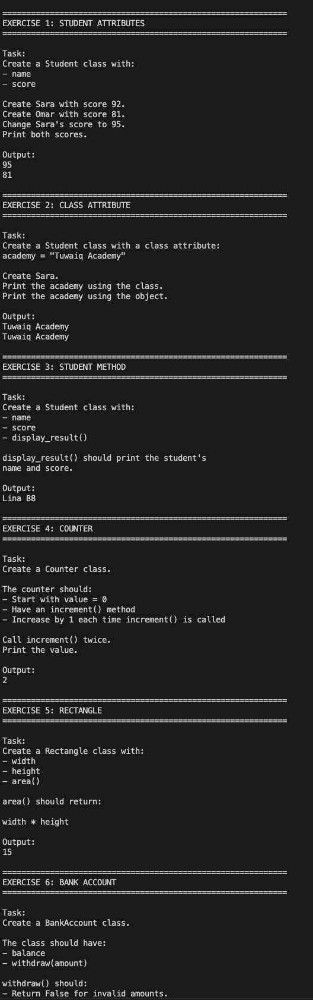
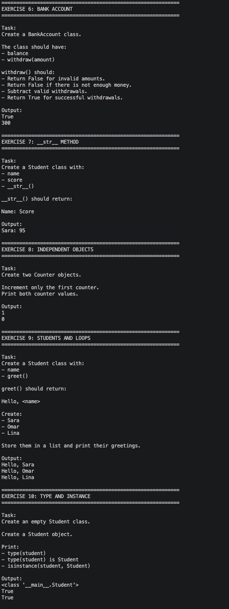
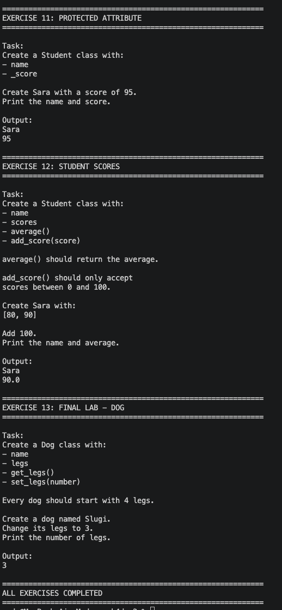

# 🐍 Python OOP Exercises

A collection of Python Object-Oriented Programming exercises covering the fundamentals of **classes, objects, attributes, methods, and object behavior**.

---

## 📚 Exercises

The exercises are divided into **3 parts**, progressing from basic OOP concepts to more practical examples.

### Part 1 — OOP Fundamentals

The first part introduces the basic concepts of Python classes and objects.

Topics include:

* Creating classes
* Creating objects
* `__init__()`
* Instance attributes
* Class attributes
* Instance methods
* Modifying object attributes
* Object state
* Basic calculations with objects

Exercises:

1. Student Attributes
2. Class Attributes
3. Student Methods
4. Counter
5. Rectangle

---

### Part 2 — Working With Objects

The second part builds on the fundamentals and introduces more object-oriented features.

Topics include:

* Conditional logic inside methods
* Returning values
* `__str__()`
* Multiple independent objects
* Lists of objects
* Loops with objects
* `type()`
* `isinstance()`
* Protected attributes

Exercises:

6. Bank Account
7. String Representation
8. Independent Objects
9. Students and Loops
10. Type and Instance
11. Protected Attributes

---

### Part 3 — Practical OOP

The final part combines multiple concepts into more complete exercises.

Topics include:

* Lists inside objects
* Methods that modify object data
* Input validation
* Calculating averages
* Encapsulation conventions
* Getters and setters
* Object state
* Combining multiple OOP concepts

Exercises:

12. Student Scores
13. Dog Legs — Final Lab

---

## 🖥️ Output

### Part 1



### Part 2



### Part 3



---

## 📂 Project Structure

```text
python-oop-exercises/
│
├── oop_exercises.py
│
├── README.md
│
├── image.png
├── image-1.png
└── image-2.png
```

---

## ▶️ How to Run

Make sure Python is installed on your computer.

Run the exercises with:

```bash
python oop_exercises.py
```

The program will display each exercise separately in the terminal.

---

## 🎯 Learning Goals

By completing these exercises, you will practice how to:

* Define Python classes
* Create objects from classes
* Store data using instance attributes
* Use class attributes
* Create and call methods
* Modify object state
* Return values from methods
* Work with lists of objects
* Use loops with objects
* Understand `type()` and `isinstance()`
* Work with protected attributes
* Build simple object-oriented programs

---

## 🏁 Final Lab

The final exercise is a **Dog** class that combines several concepts learned throughout the exercises.

The final lab uses:

```text
Class
  ↓
Object
  ↓
Attributes
  ↓
Methods
  ↓
Object State
  ↓
Getters / Setters
```

---

## 📌 Concepts Summary

| Part   | Main Concepts                                         |
| ------ | ----------------------------------------------------- |
| Part 1 | Classes, objects, attributes, methods                 |
| Part 2 | Object behavior, `__str__()`, types, multiple objects |
| Part 3 | Lists, validation, getters, setters, final lab        |

---

## 👨‍💻 Practice

These exercises are designed to be completed in order.

Start with **Exercise 1** and gradually work through to the **Final Lab**.

```text
Exercise 1
    ↓
Exercise 2
    ↓
Exercise 3
    ↓
...
    ↓
Exercise 13
    ↓
Final Lab
```

---

## ⭐ Completion

**Python OOP Exercises — Completed**

```text
Part 1 ✅
Part 2 ✅
Part 3 ✅
Final Lab ✅
```
