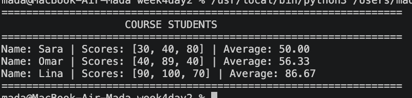

# 🐍 Python OOP — Guided Practice

This guided practice demonstrates how multiple Python classes can work together to build a simple **Student and Course Management System**.

---

## 🎯 Guided Practice

### Student & Course Management

In this practice, we create:

* A `Student` class
* A `Course` class
* Student scores
* Student averages
* A list of students inside a course
* Methods for adding students
* Methods for displaying student information

---

## 📚 Concepts Covered

### 1. Classes and Objects

The practice uses two classes:

```python
class Student:
    ...
```

and:

```python
class Course:
    ...
```

Objects are then created from these classes.

---

### 2. Instance Attributes

Each student has:

```text
name
scores
```

Each course has:

```text
students
```

This allows every object to maintain its own data.

---

### 3. Instance Methods

The `Student` class contains:

```python
add_score()
average()
```

The `Course` class contains:

```python
display()
add_student()
```

These methods define the behavior of each object.

---

### 4. Working With Lists

The course stores multiple students in a list:

```python
self.students
```

Students' scores are also stored in a list:

```python
self.scores
```

---

### 5. `isinstance()`

Before adding a student to the course, the program checks that the object is actually a `Student`:

```python
if isinstance(student, Student):
    self.students.append(student)
```

---

### 6. Calculating an Average

The student's average is calculated using:

```python
sum(self.scores) / len(self.scores)
```

If there are no scores, the method returns:

```text
0
```

---

## 🖥️ Output

The program displays each student's:

* Name
* Scores
* Average

Example:



---

## 📊 Example

The course contains three students:

| Student | Scores          | Average |
| ------- | --------------- | ------: |
| Sara    | `[30, 40, 80]`  |   50.00 |
| Omar    | `[40, 89, 40]`  |   56.33 |
| Lina    | `[90, 100, 70]` |   86.67 |

---

## 📂 Project Structure

```text
python-oop/
│
├── guided_practice.py
├── README.md
└── image.png
```

---

## ▶️ How to Run

Run the Python file from the terminal:

```bash
python guided_practice.py
```

---

## 💡 Important Python Practice

The implementation avoids using mutable lists as default arguments.

Instead of:

```python
def __init__(self, name, scores=[]):
```

we use:

```python
def __init__(self, name, scores=None):
    self.scores = scores if scores is not None else []
```

The same approach is used for the course's student list.

This ensures that different `Student` and `Course` objects do not accidentally share the same list.

---

## 🏁 Learning Goal

After completing this guided practice, you should be able to create multiple classes and make them work together.

The overall relationship is:

```text
Course
  │
  ├── Student
  │     ├── Name
  │     ├── Scores
  │     └── Average
  │
  ├── Student
  │     ├── Name
  │     ├── Scores
  │     └── Average
  │
  └── Student
        ├── Name
        ├── Scores
        └── Average
```

This practice is a step toward building larger Python applications using **Object-Oriented Programming**.
