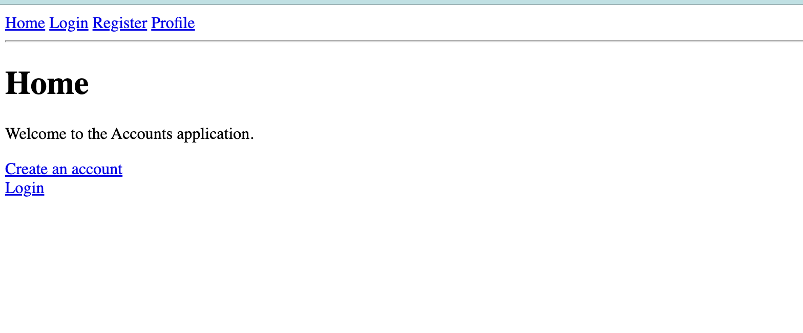
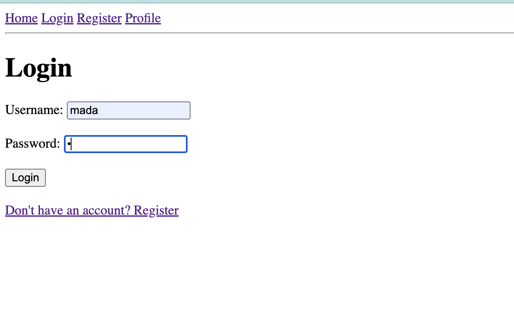
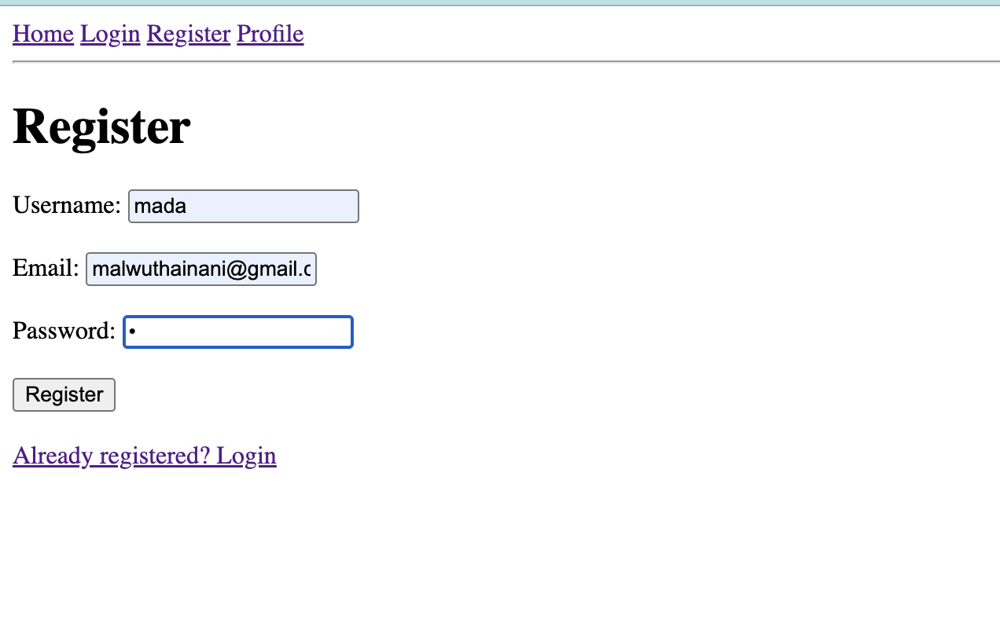
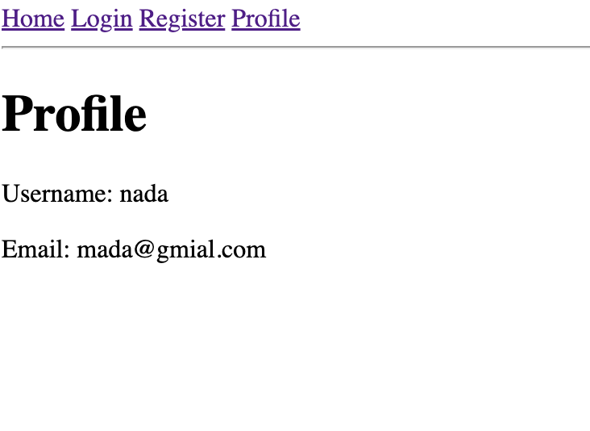

# Django Accounts — Session Authentication

A simple Django project that demonstrates **Class-Based Views (CBV)**, **sessions**, **registration**, **login**, and **profile pages** without using a database model for users.

## Features

* Home page
* User registration
* Login
* Profile page
* Class-Based Views using `View`
* `GET` and `POST` methods
* Session-based user storage
* Multiple users can be registered in the session
* Prevents duplicate usernames
* Automatically logs in a newly registered user
* Redirects logged-in users to their profile
* Protects the profile from unauthenticated users

## Project Structure

```text
project/
│
├── manage.py
│
├── project/
│   ├── settings.py
│   ├── urls.py
│   └── ...
│
└── accounts/
    ├── views.py
    ├── urls.py
    │
    └── templates/
        ├── base.html
        ├── index.html
        ├── login.html
        ├── register.html
        └── profile.html
```

## Setup

Create and activate a virtual environment:

```bash
python3 -m venv venv
source venv/bin/activate
```

Install Django:

```bash
pip install django
```

Run the development server:

```bash
python manage.py runserver
```

Open:

```text
http://127.0.0.1:8000/
```

## Session Configuration

Because this project does **not use the database for storing sessions**, configure Django to use signed-cookie sessions in `settings.py`:

```python
SESSION_ENGINE = "django.contrib.sessions.backends.signed_cookies"
```

Make sure `SessionMiddleware` exists:

```python
MIDDLEWARE = [
    "django.middleware.security.SecurityMiddleware",
    "django.contrib.sessions.middleware.SessionMiddleware",
    "django.middleware.common.CommonMiddleware",
    # ...
]
```

The session information is stored in the browser's cookie instead of the `django_session` database table.

## URLs

The `accounts/urls.py` contains:

```python
from django.urls import path
from .views import HomeView, LoginView, RegisterView, ProfileView

urlpatterns = [
    path("", HomeView.as_view(), name="home"),
    path("login/", LoginView.as_view(), name="login"),
    path("register/", RegisterView.as_view(), name="register"),
    path("profile/", ProfileView.as_view(), name="profile"),
]
```

The available pages are:

| URL          | View           | Purpose              |
| ------------ | -------------- | -------------------- |
| `/`          | `HomeView`     | Home page            |
| `/register/` | `RegisterView` | Register a user      |
| `/login/`    | `LoginView`    | Login                |
| `/profile/`  | `ProfileView`  | Display current user |

## Registration Flow

When a user submits the registration form:

```python
username = request.POST.get("username")
email = request.POST.get("email")
password = request.POST.get("password")
```

The users are stored in the session:

```python
users = request.session.get("users", {})
```

A new user is added:

```python
users[username] = {
    "email": email,
    "password": password,
}

request.session["users"] = users
```

The newly registered user becomes the current user:

```python
request.session["username"] = username
request.session["logged_in"] = True
```

Then the user is redirected:

```python
return redirect("profile")
```

## Duplicate Registration

Before adding a user, the application checks:

```python
if username in users:
```

If the username already exists:

```python
return render(
    request,
    "register.html",
    {
        "message": "This username is already registered."
    }
)
```

## Login Flow

The login view reads the users from the session:

```python
users = request.session.get("users", {})
```

It checks whether the username exists:

```python
if username not in users:
    return render(
        request,
        "login.html",
        {
            "message": "User is not registered."
        }
    )
```

Then it checks the password:

```python
if users[username]["password"] != password:
    return render(
        request,
        "login.html",
        {
            "message": "Invalid username or password."
        }
    )
```

If the credentials are correct:

```python
request.session["username"] = username
request.session["logged_in"] = True

return redirect("profile")
```

## Profile

The profile checks whether the user is logged in:

```python
if not request.session.get("logged_in"):
    return redirect("login")
```

Then it gets the current username:

```python
username = request.session.get("username")
```

And gets the user's information:

```python
users = request.session.get("users", {})
user = users.get(username)
```

The data is passed to the template using **context**:

```python
context = {
    "username": username,
    "email": user["email"],
}
```

Then:

```python
return render(request, "profile.html", context)
```

In `profile.html`:

```html
<h1>Profile</h1>

<p>Username: {{ username }}</p>
<p>Email: {{ email }}</p>
```

## CBV Concept

This project uses Django **Class-Based Views**:

```python
class RegisterView(View):

    def get(self, request):
        ...

    def post(self, request):
        ...
```

Django decides which method to call based on the HTTP request:

```text
GET
 ↓
RegisterView.get()

POST
 ↓
RegisterView.post()
```

The URL uses:

```python
RegisterView.as_view()
```

which converts the class into a Django view callable.

## Screenshots









## Important Note

This project is designed for **learning Django sessions and CBVs**.

It intentionally does not use:

* Django's `User` model
* A custom user model
* A database for user registration

The registered users exist only inside the browser's session. Clearing the session/cookies removes them.

