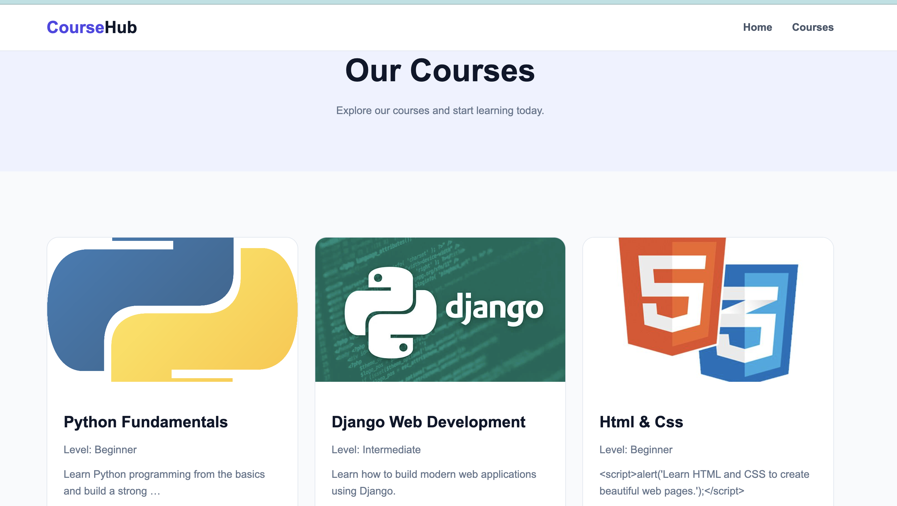
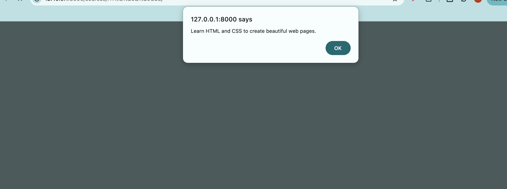

# CourseHub - Django Courses Project

A simple Django project that displays courses using **Django templates, template inheritance, reusable includes, URL routing, template filters, and static files**.

The project contains a home page, courses page, and course details page. Each course is displayed using a reusable `course_card.html` template.

---

## Features

* 🏠 Home page
* 📚 Courses listing page
* 📖 Course details page
* 🧩 Reusable `course_card.html` component
* 🔗 Django named URLs and namespaces
* 🖼️ Static images and CSS
* 🎨 Responsive modern design
* `` loop
* `` conditions
* `` handling
* `|title` filter
* `|truncatewords` filter
* `|safe` filter with trusted HTML content
* Custom `404` handling for courses that don't exist

---

## Project Structure

```text
multiPage/
│
├── manage.py
│
├── multiPage/
│   ├── __init__.py
│   ├── settings.py
│   ├── urls.py
│   ├── asgi.py
│   └── wsgi.py
│
├── coursesApp/
│   ├── migrations/
│   ├── __init__.py
│   ├── admin.py
│   ├── apps.py
│   ├── models.py
│   ├── tests.py
│   ├── views.py
│   └── urls.py
│
├── templates/
│   ├── base.html
│   ├── navbar.html
│   ├── footer.html
│   ├── course_card.html
│   │
│   └── coursesApp/
│       ├── home.html
│       ├── courses.html
│       └── course_detail.html
│
└── static/
    ├── css/
    │   └── style.css
    │
    └── images/
        ├── python.jpg
        ├── django.jpg
        ├── html-css.jpg
        └── javascript.jpg
```

---

## Course Data

Courses are currently stored in a Python list inside `views.py`.

Each course contains exactly these fields:

```python
{
    "name": "Python Fundamentals",
    "level": "Beginner",
    "student_count": 120,
    "description": "Learn Python programming from the basics and build a strong foundation.",
    "image": "python.jpg",
}
```

The available fields are:

| Field           | Description                 |
| --------------- | --------------------------- |
| `name`          | Course name                 |
| `level`         | Course difficulty level     |
| `student_count` | Number of enrolled students |
| `description`   | Course description          |
| `image`         | Image filename              |

---

## URL Routing

The `coursesApp` application uses the following URLs:

| URL                               | View            | Name                       |
| --------------------------------- | --------------- | -------------------------- |
| `/`                               | `home`          | `coursesApp:home`          |
| `/courses/`                       | `course_list`   | `coursesApp:courses`       |
| `/courses/Python%20Fundamentals/` | `course_detail` | `coursesApp:course_detail` |

### `coursesApp/urls.py`

```python
from django.urls import path
from . import views

app_name = "coursesApp"

urlpatterns = [
    path("", views.home, name="home"),
    path("courses/", views.course_list, name="courses"),
    path(
        "courses/<str:course_name>/",
        views.course_detail,
        name="course_detail",
    ),
]
```

---

## Views

The application has three main views:

### Home

```python
def home(request):
    return render(request, "coursesApp/home.html")
```

### Course List

```python
def course_list(request):
    return render(
        request,
        "coursesApp/courses.html",
        {"courses": courses},
    )
```

### Course Detail

The course name is received from the URL and used to find the correct course.

```python
def course_detail(request, course_name):

    for course in courses:
        if course["name"].lower() == course_name.lower():

            return render(
                request,
                "coursesApp/course_detail.html",
                {
                    "name": course["name"],
                    "level": course["level"],
                    "student_count": course["student_count"],
                    "description": course["description"],
                    "image": course["image"],
                }
            )

    raise Http404("Course not found")
```

Each course key is passed separately to the detail template:

```python
{
    "name": course["name"],
    "level": course["level"],
    "student_count": course["student_count"],
    "description": course["description"],
    "image": course["image"],
}
```

---

## Reusable Course Card

Instead of writing the course card HTML multiple times, the project uses:

```text
templates/course_card.html
```

The courses page includes it:

```django


    



    <p>No courses available.</p>


```

The current `course` object is automatically available inside the included template.

This makes the course card **reusable**.

---

## Template Features

### `for`

Courses are displayed using a Django template loop:

```django

    ...

```

### `empty`

If there are no courses:

```django

    <p>No courses available.</p>
```

### `if`

The project displays a different message when a course has zero students:

```django

    <p>No students enrolled yet.</p>

    <p>{{ course.student_count }} students enrolled.</p>

```

### `title`

The `title` filter formats course names:

```django
{{ course.name|title }}
```

### `truncatewords`

Long descriptions are shortened:

```django
{{ course.description|truncatewords:10 }}
```

### `safe`

The project also demonstrates the `safe` filter with trusted course content:

```django
{{ description|safe }}
```

For example, trusted content can contain:

```python
"description": "Learn <strong>Python</strong> from the basics."
```

The `<strong>` tag will be rendered as HTML instead of being displayed as plain text.

> **Important:** `safe` should only be used with trusted content. It should not be used directly on HTML submitted by untrusted users.

---

## Template Inheritance

The project uses a shared `base.html`:

```django

```

The base template contains:

```django






```

This means the navbar and footer are reused across all pages.

---

## Static Files

CSS and images are stored in the `static` directory:

```text
static/
├── css/
│   └── style.css
└── images/
    ├── python.jpg
    ├── django.jpg
    ├── html-css.jpg
    └── javascript.jpg
```

`settings.py`:

```python
STATIC_URL = "static/"

STATICFILES_DIRS = [
    BASE_DIR / "static",
]
```

Templates load static files with:

```django

```

Images are displayed using:

```django

```

---

## Installation

Create and activate a virtual environment:

```bash
python3 -m venv venv
```

Activate it on macOS/Linux:

```bash
source venv/bin/activate
```

Install Django:

```bash
python3 -m pip install django
```

Run migrations:

```bash
python3 manage.py migrate
```

Start the development server:

```bash
python3 manage.py runserver
```

Open:

```text
http://127.0.0.1:8000/
```

---

## MVT Flow

The project follows Django's **MVT (Model-View-Template)** architecture.

```text
User
 │
 │ Request
 ▼
URL
 │
 ▼
View
 │
 ├── Gets course data
 │
 ▼
Template
 │
 ├── base.html
 ├── navbar.html
 ├── course_card.html
 └── footer.html
 │
 ▼
HTML Response
 │
 ▼
User
```

For a course detail page:

```text
/courses/Python%20Fundamentals/
            │
            ▼
      course_detail()
            │
            ▼
      Find course by name
            │
            ▼
  Pass course keys separately
            │
            ▼
    course_detail.html
            │
            ▼
       HTML Response
```

---

## Screenshots

### Home Page



### Course Details


### Safe Filter



---

## Technologies

* Python
* Django
* HTML5
* CSS3
* Django Template Language
* Django Static Files

---

## Main Concepts Practiced

This project demonstrates:

1. Django project and app structure
2. URL routing
3. Named URLs
4. URL namespaces
5. Function-based views
6. Passing context to templates
7. Template inheritance
8. ``
9. Reusable template components
10. `` loops
11. `` conditions
12. ``
13. Template filters
14. Static files
15. Responsive CSS
16. HTTP 404 handling
17. Trusted HTML with `|safe`
