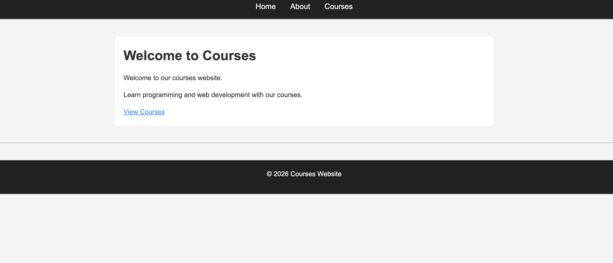
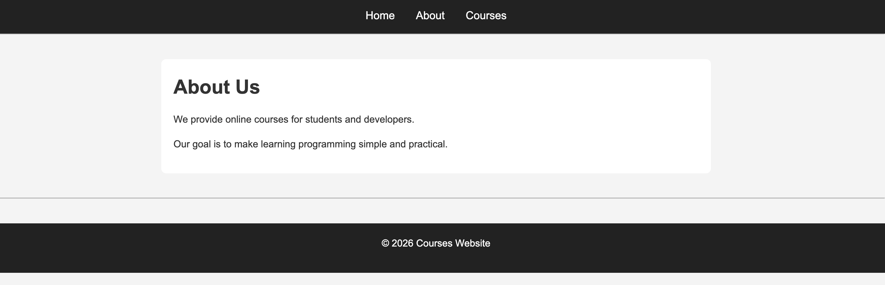
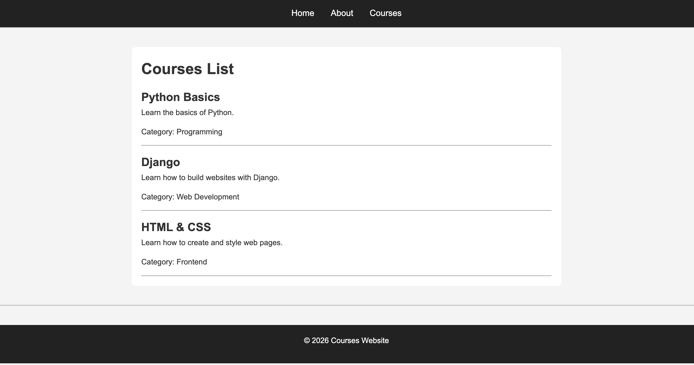

# MultiPage Django Project

A simple Django website demonstrating **multiple pages, template inheritance, reusable components, URL namespaces, and static CSS files**.

## 📁 Project Structure

```text
multiPage/
│
├── manage.py
│
├── multiPage/
│   ├── __init__.py
│   ├── settings.py
│   ├── urls.py
│   ├── asgi.py
│   └── wsgi.py
│
├── courses/
│   ├── migrations/
│   ├── __init__.py
│   ├── admin.py
│   ├── apps.py
│   ├── models.py
│   ├── tests.py
│   ├── urls.py
│   └── views.py
│
├── templates/
│   ├── base.html
│   ├── navBar.html
│   ├── footer.html
│   │
│   └── courses/
│       ├── home.html
│       ├── about.html
│       └── list.html
│
└── static/
    └── css/
        └── style.css
```

## 🚀 Features

* Django project named `multiPage`
* `courses` Django app
* Three pages:

  * Home
  * About
  * Courses List
* Reusable `base.html`
* Separate navbar and footer templates
* Template inheritance with ``
* Template components with ``
* Django URL namespaces
* Static CSS files
* Course data passed from the view to the template

## 🔗 URLs

| Page         | URL               |
| ------------ | ----------------- |
| Home         | `/courses/`       |
| About        | `/courses/about/` |
| Courses List | `/courses/list/`  |

## 🧩 Template Inheritance

The project uses `base.html` as the main layout.

```text
base.html
   │
   ├── navBar.html
   │
   ├── 
   │       │
   │       ├── home.html
   │       ├── about.html
   │       └── list.html
   │
   └── footer.html
```

Each page extends the base template:

```html

```

This prevents repeating the navbar and footer on every page.

## 🧭 Navigation

The navbar uses Django's URL names:

```html
<a href="">Home</a>
<a href="">About</a>
<a href="">Courses</a>
```

The `courses` part comes from:

```python
app_name = "courses"
```

And `home`, `about`, and `list` come from the URL names:

```python
path("", views.home, name="home"),
path("about/", views.about, name="about"),
path("list/", views.course_list, name="list"),
```

## 🎨 Static CSS

The CSS file is located at:

```text
static/css/style.css
```

It is loaded in `base.html`:

```django


<link rel="stylesheet" href="">
```

Because all pages extend `base.html`, the CSS is automatically applied to all pages.

## ⚙️ Installation

Clone or create the project and create a virtual environment:

```bash
python3 -m venv venv
source venv/bin/activate
```

Install Django:

```bash
python3 -m pip install django
```

Run migrations:

```bash
python3 manage.py migrate
```

Start the development server:

```bash
python3 manage.py runserver
```

Open:

```text
http://127.0.0.1:8000/courses/
```

## 🔄 Django Request Flow

For example, when visiting:

```text
/courses/list/
```

Django follows this flow:

```text
Browser
   ↓
multiPage/urls.py
   ↓
courses/urls.py
   ↓
course_list()
   ↓
courses/list.html
   ↓
base.html
   ↓
navBar.html + content + footer.html
```

## 📝 Main Concepts

### `include()`

Connects the `courses` app URLs to the main project:

```python
path("courses/", include("courses.urls")),
```

### `app_name`

Creates a namespace for the app:

```python
app_name = "courses"
```

### `render()`

Returns an HTML template from a view:

```python
return render(request, "courses/home.html")
```

### ``

Allows a page to inherit from the base template:

```django

```

### ``

Loads reusable templates:

```django


```

### ``

Generates URLs using their names:

```django

```

## 👨‍💻 Technologies

* Python
* Django
* HTML
* CSS
* Django Templates
* Static Files

## 📸 Screenshots of the Result

Add your screenshots here:

```markdown





```

These screenshots demonstrate the final pages and the shared navbar/footer layout.
