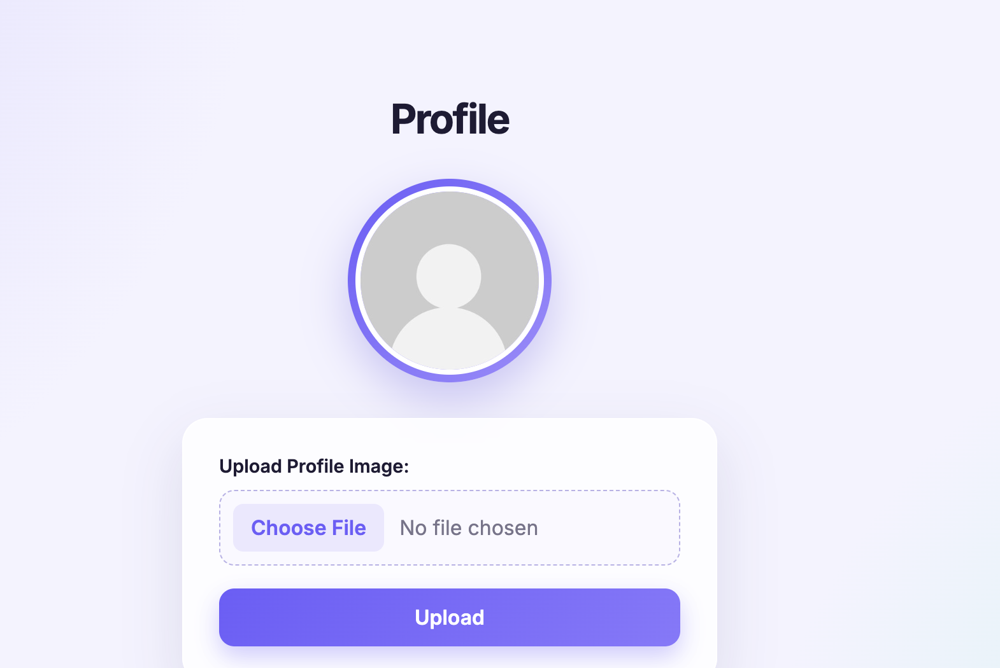

# README.md

# Django Image Upload Project

A simple Django project that demonstrates how to upload and display a profile image using Django's **media files** system.

The project includes a profile page with a default avatar. When the user uploads an image, the uploaded image is displayed instead of the default avatar.

## Features

* Django project setup
* Image upload form
* `multipart/form-data` upload
* Handling uploaded files with `request.FILES`
* `MEDIA_URL` configuration
* `MEDIA_ROOT` configuration
* Serving media files during development
* Default profile avatar
* Responsive and elegant profile page
* Static CSS file
* Conditional image display using Django templates

## Project Structure

```text
src/
├── manage.py
│
├── uploadimages/
│   ├── __init__.py
│   ├── settings.py
│   ├── urls.py
│   └── ...
│
├── images/
│   ├── __init__.py
│   ├── admin.py
│   ├── apps.py
│   ├── models.py
│   ├── urls.py
│   ├── views.py
│   └── ...
│
├── templates/
│   └── images/
│       └── profile.html
│
├── static/
│   ├── css/
│   │   └── main.css
│   └── images/
│       └── default-avatar.png
│
└── media/
```

## Static Files

Static files are files that belong to the project, such as CSS, JavaScript, and default images.

In `settings.py`:

```python
STATIC_URL = "static/"

STATICFILES_DIRS = [
    BASE_DIR / "static",
]

STATIC_ROOT = BASE_DIR / "staticfiles"
```

The project CSS is located at:

```text
static/css/main.css
```

The default avatar is located at:

```text
static/images/default-avatar.png
```

## Media Files

Media files are files uploaded by users.

In `settings.py`:

```python
MEDIA_URL = "media/"
MEDIA_ROOT = BASE_DIR / "media"
```

Uploaded images are stored inside:

```text
media/
```

## Serving Media in Development

In `uploadimages/urls.py`:

```python
from django.conf import settings
from django.conf.urls.static import static
from django.contrib import admin
from django.urls import include, path

urlpatterns = [
    path("admin/", admin.site.urls),
    path("", include("images.urls")),
]

if settings.DEBUG:
    urlpatterns += static(
        settings.MEDIA_URL,
        document_root=settings.MEDIA_ROOT,
    )
```

This allows Django to serve uploaded images while `DEBUG=True`.

## Upload Form

The form uses:

```html
<form method="POST" enctype="multipart/form-data">
```

The important part is:

```html
enctype="multipart/form-data"
```

Without it, the image file will not be sent correctly to Django.

The file input:

```html
<input
    type="file"
    name="image"
    accept="image/*"
    required
>
```

## View

The upload is handled in `images/views.py`:

```python
from django.conf import settings
from django.core.files.storage import FileSystemStorage
from django.shortcuts import render


def profile(request):
    image_url = None

    if request.method == "POST":
        image = request.FILES.get("image")

        if image:
            fs = FileSystemStorage(location=settings.MEDIA_ROOT)
            filename = fs.save(image.name, image)
            image_url = fs.url(filename)

    return render(
        request,
        "images/profile.html",
        {
            "image_url": image_url,
        },
    )
```

### How it works

```text
User selects image
        ↓
multipart/form-data
        ↓
request.FILES
        ↓
FileSystemStorage
        ↓
MEDIA_ROOT
        ↓
image_url
        ↓
Profile page displays image
```

## URLs

### App URLs

`images/urls.py`:

```python
from django.urls import path
from . import views

app_name = "images"

urlpatterns = [
    path("profile/", views.profile, name="profile"),
]
```

### Profile URL

Open:

```text
http://127.0.0.1:8000/profile/
```

## Template

The profile template checks whether an uploaded image exists:

```django

    

    

```

Therefore:

* Before uploading → default avatar is displayed.
* After uploading → uploaded image is displayed.

## CSS

The profile page uses:

```html
<link rel="stylesheet" href="">
```

The CSS provides:

* Clean white profile card
* Circular profile image
* Soft background
* Subtle shadows
* Simple upload button
* Responsive mobile layout

## Installation

Create and activate a virtual environment:

```bash
python3 -m venv venv
source venv/bin/activate
```

Install Django:

```bash
python3 -m pip install django
```

Run migrations:

```bash
python3 manage.py migrate
```

Start the development server:

```bash
python3 manage.py runserver
```

Then visit:

```text
http://127.0.0.1:8000/profile/
```

## Important Django Concepts

### `STATIC_URL`

Defines the URL used for static files:

```python
STATIC_URL = "static/"
```

### `STATICFILES_DIRS`

Tells Django where your development static files are located:

```python
STATICFILES_DIRS = [
    BASE_DIR / "static",
]
```

### `STATIC_ROOT`

Defines where static files are collected for deployment:

```python
STATIC_ROOT = BASE_DIR / "staticfiles"
```

### `MEDIA_URL`

Defines the URL prefix for uploaded files:

```python
MEDIA_URL = "media/"
```

### `MEDIA_ROOT`

Defines where uploaded files are physically stored:

```python
MEDIA_ROOT = BASE_DIR / "media"
```

### `request.FILES`

Django uses `request.FILES` to access uploaded files:

```python
image = request.FILES.get("image")
```

### `multipart/form-data`

Required when an HTML form uploads files:

```html
<form method="POST" enctype="multipart/form-data">
```

## Screenshots

### Before Upload

The profile page displays the default avatar:

```text
Profile

      ○
 Default Avatar

Upload Profile Image
[ Choose File ]

[ Upload Image ]
```

### After Upload

After selecting and uploading an image, the uploaded image is displayed in the profile area.

## Technologies

* Python
* Django
* HTML
* CSS
* Django Static Files
* Django Media Files

## Learning Goals

This project demonstrates the difference between:

```text
Static Files
    ↓
Files included with the project
    ↓
CSS / default images / JavaScript
```

and:

```text
Media Files
    ↓
Files uploaded by users
    ↓
Profile pictures / uploaded images
```

## Screenshots

### Before Upload

The profile page displays the default avatar before an image is uploaded.



### After Upload

After selecting and uploading an image, the uploaded profile image is displayed.


## Note

The current implementation stores the uploaded image for the current request. It does **not** associate the image with a database user/profile yet.

A future version can use a Django model with an `ImageField` so the profile picture remains saved and displayed after refreshing or reopening the page.
