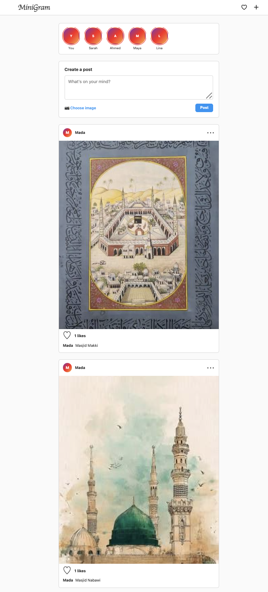

# Mini Instagram Lab

## Overview

In this lab, we built a simple Instagram-style feed using **Django**. The main goal was to learn how Django handles **models, databases, image uploads, sessions, views, URLs, and templates**.

We created a `Post` model that represents a social media post. Each post contains a username, description, image, and number of likes.

## What We Built

The application allows a user to:

* Create a post with a description and image.
* Automatically use the username stored in the session.
* Upload only JPG, JPEG, and PNG images.
* Display all posts in a feed.
* Like posts and increase the like count.
* Display **"Be the first to like this"** when a post has 0 likes.
* Store uploaded images inside `media/posts/`.

## What We Learned

### 1. Django Models

We learned how to create a Django model using `models.Model`.

```python
class Post(models.Model):
    username = models.CharField(max_length=100)
    description = models.TextField()
    image = models.ImageField(upload_to="posts/")
    likes = models.IntegerField(default=0)
```

A model represents the structure of data in our application.

For example, each `Post` has:

| Field         | Purpose                               |
| ------------- | ------------------------------------- |
| `username`    | Stores the post author's username     |
| `description` | Stores the post text                  |
| `image`       | Stores the path to the uploaded image |
| `likes`       | Stores the number of likes            |

### 2. Models and SQL Database

We learned that Django models are connected to a **SQL database**.

In our project, we used **SQLite**, which is Django's default database.

When we created the `Post` model and ran:

```bash
python3 manage.py makemigrations
python3 manage.py migrate
```

Django created the database structure for our model.

Instead of writing SQL manually, Django's **ORM (Object-Relational Mapper)** allows us to work with the database using Python.

For example:

```python
Post.objects.all()
```

gets all posts from the database.

And:

```python
Post.objects.create(
    username=username,
    description=description,
    image=image,
)
```

creates a new record in the database.

So we learned that:

```text
Python / Django Model
        ↓
      Django ORM
        ↓
    SQL Database
        ↓
    SQLite (db.sqlite3)
```

### 3. Image Uploads

We learned that an `ImageField` does not normally store the actual image inside SQLite.

The database stores the **image path**, while the actual image is saved in:

```text
media/posts/
```

For example:

```text
Database:
posts/photo.jpg

Actual file:
media/posts/photo.jpg
```

We also learned how to use:

```html
enctype="multipart/form-data"
```

and:

```python
request.FILES
```

to receive uploaded files.

### 4. Sessions

We used Django sessions to temporarily store the username.

For now, we set:

```python
request.session["username"] = "Mada"
```

Then we retrieve it with:

```python
username = request.session["username"]
```

This means the user doesn't need to enter their username every time they create a post.

Later, this can be connected to a real login system.

### 5. Views and URLs

We learned how views handle requests and interact with models.

For example, the feed gets posts using:

```python
posts = Post.objects.all().order_by("-id")
```

The URL connects the browser to the view:

```python
path("", views.feed, name="feed")
```

### 6. Likes

We created a view that increases the number of likes:

```python
post.likes += 1
post.save()
```

`save()` tells Django to save the updated value back to the database.

We also used a Django template condition:

```django

    Be the first to like this

    {{ post.likes }} likes

```

This allowed the page to display different content depending on the database value.

## Screenshot



## Main Concepts Learned

This lab helped us understand the basic flow of a Django application:

```text
User
 ↓
HTML Form
 ↓
URL
 ↓
View
 ↓
Model / ORM
 ↓
SQL Database
 ↓
Template
 ↓
Web Page
```

The most important concept we learned is that **Django Models provide a Python way to work with SQL databases without having to write SQL queries manually**.
