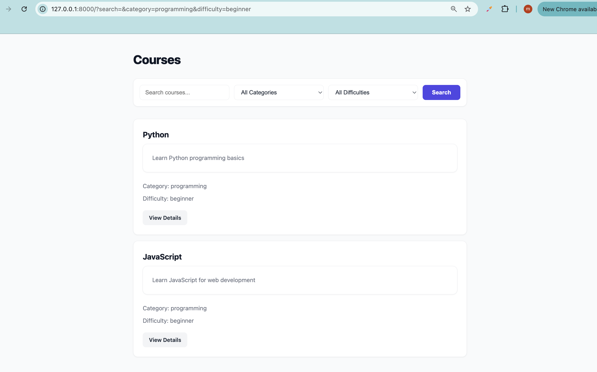
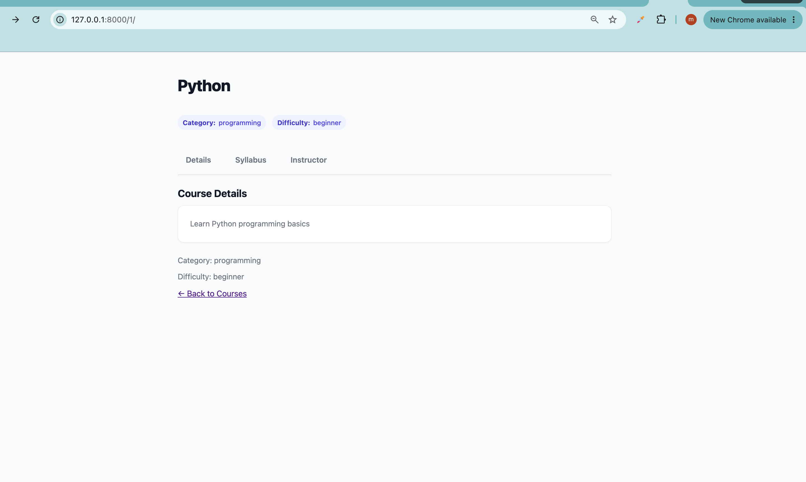
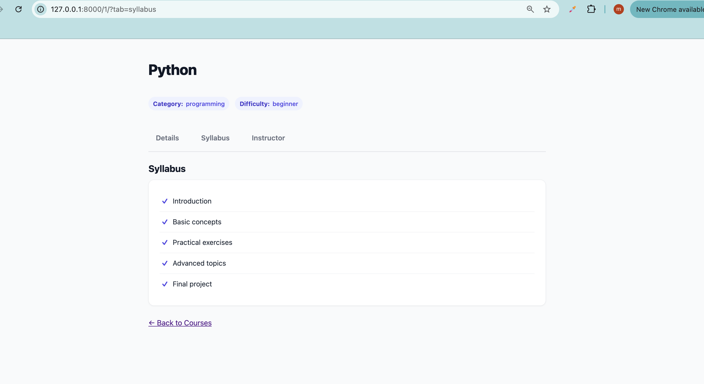

# Courses Lab

## Overview

In this lab, we built a simple **Courses application using Django**.

The goal was to practice working with **views, URLs, templates, GET parameters, searching, filtering, dynamic URLs, query parameters, tabs, and pagination**.

For this lab, we used a **mock list of courses** instead of a database or Django model.

---

## What We Built

The application allows users to:

* View all available courses.
* Search for a course by name.
* Filter courses by **category**.
* Filter courses by **difficulty**.
* Open a specific course using its ID.
* View different tabs for a course.
* Navigate between pages using pagination.
* Preserve search and filter values when navigating between pages.
* Use CSS through Django static files.

---

## Course Data

We created a mock list of courses in `views.py`.

Each course contains:

```python
{
    "id": 1,
    "name": "Python",
    "description": "Learn Python programming basics",
    "category": "programming",
    "difficulty": "beginner",
}
```

The courses have different categories and difficulty levels so that searching and filtering can be tested properly.

---

## Routes

### Course List

```text
/courses/
```

This route displays all courses.

```python
path("", views.course_list, name="course_list")
```

### Course Details

```text
/courses/<int:id>/
```

For example:

```text
/courses/1/
/courses/2/
/courses/3/
```

The `id` is used to find and display the selected course.

---

## Search and Filtering

We used a GET form:

```html
<form method="GET">
```

The user can search for a course and filter by category and difficulty.

Example:

```text
/courses/?search=python
```

We read the values using:

```python
search = request.GET.get("search", "")
category = request.GET.get("category", "all")
difficulty = request.GET.get("difficulty", "all")
```

We also used default values such as `"all"` and `""` so the application can handle missing query parameters gracefully.

---

## Pagination

We used Django's `Paginator` to divide the courses into multiple pages.

The page is controlled using:

```text
?page=2
```

For example:

```text
/courses/?page=2
```

We also used Django's `querystring` template tag to preserve the existing search and filter parameters when changing pages.

For example:

```text
/courses/?search=python&category=programming&difficulty=beginner&page=2
```

When moving to another page, the search and filters are preserved.

---

## Course Detail Tabs

The course detail page supports different tabs using the `tab` GET parameter.

### Details

```text
/courses/1/?tab=details
```

### Syllabus

```text
/courses/1/?tab=syllabus
```

### Instructor

```text
/courses/1/?tab=instructor
```

In the view, we use:

```python
tab = request.GET.get("tab", "details")
```

This means the default tab is **Details** if no `tab` parameter is provided.

---

## Django URL Template Tags

We used Django's `` tag instead of manually writing URLs.

For example:

```django
<a href="">
    View Details
</a>
```

This creates the correct URL dynamically based on the course ID.

---

## Static CSS

We added a CSS file inside:

```text
static/
└── css/
    └── style.css
```

We loaded Django's static template tag:

```django

```

Then included the CSS:

```html
<link rel="stylesheet" href="">
```

This allowed us to style the course list and detail pages using Django's static files system.

---

## What I Learned

This lab helped me understand how Django handles **GET requests and query parameters**.

The main flow was:

```text
User
 ↓
URL / Form
 ↓
request.GET
 ↓
View
 ↓
Filter / Search / Pagination
 ↓
Template
 ↓
Web Page
```

The main concepts I practiced were:

* Django views
* Django URL patterns
* Dynamic URL parameters
* `request.GET`
* Default values with `.get()`
* Searching
* Filtering
* Pagination
* Preserving query parameters
* Template `` tags
* Template conditions
* Static CSS files
* Passing data from views to templates

---

## Screenshots

### Filtered Courses



### Course Details



### Course Tabs


