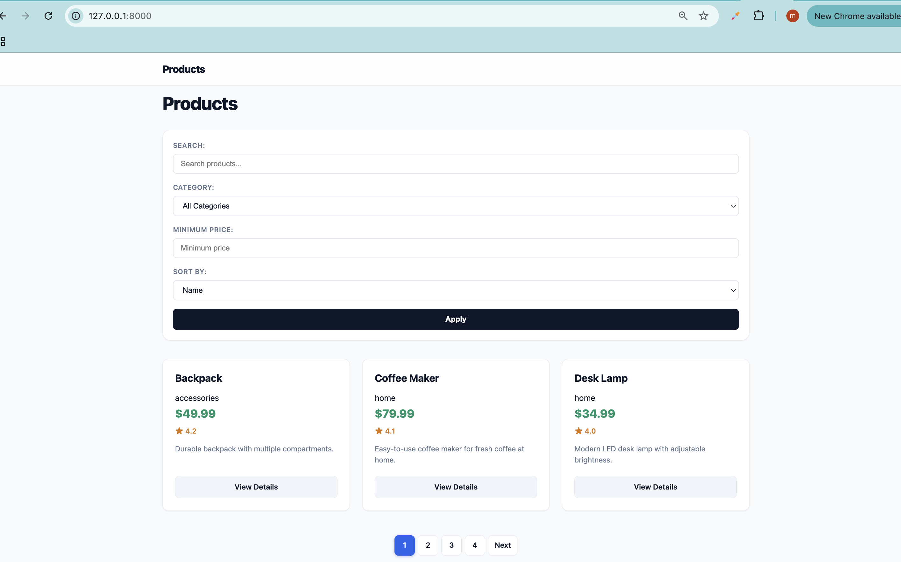
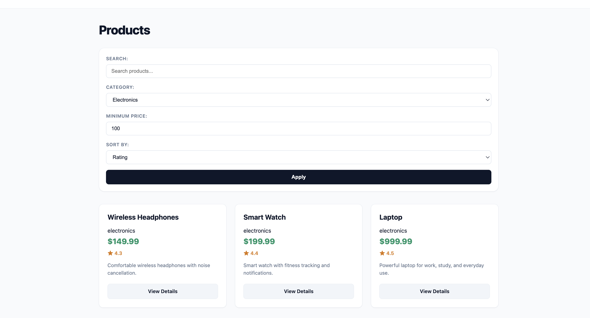
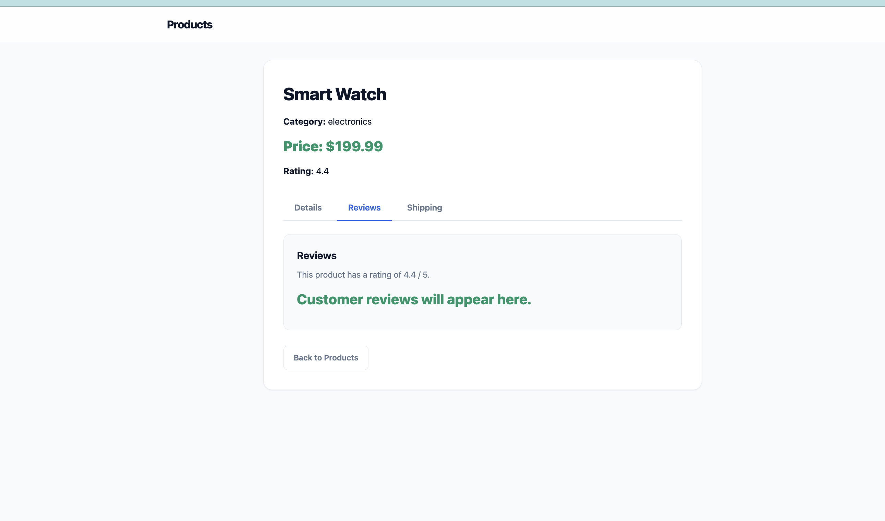
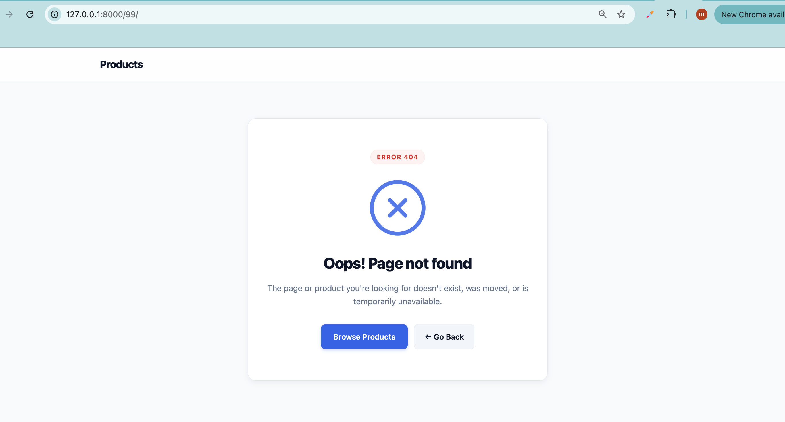

# Products Lab

## Overview

In this lab, we built a simple **Products application using Django**.

The goal was to practice working with:

- Django projects and apps
- Views
- URL routing
- Templates
- Template inheritance
- Mock data
- GET query parameters
- Searching
- Filtering
- Sorting
- Pagination
- Query parameter fallbacks
- Dynamic product details
- Product detail tabs
- Static CSS
- 404 handling

For this lab, we used a **Python list as mock data** instead of a database or Django model.

---

## Project Structure

```text
products-project/
│
├── manage.py
│
├── product_project/
│   ├── settings.py
│   ├── urls.py
│   └── ...
│
├── products/
│   ├── views.py
│   ├── urls.py
│   └── ...
│
├── templates/
│   ├── base.html
│   ├── products.html
│   ├── product_detail.html
│   └── 404.html
│
└── static/
    └── css/
        └── style.css
````

---

## Mock Product Data

We created a list of products in `products/views.py`.

Each product contains:

* `id`
* `name`
* `category`
* `price`
* `rating`
* `description`

Example:

```python
{
    "id": 1,
    "name": "Laptop",
    "category": "electronics",
    "price": 999.99,
    "rating": 4.5,
    "description": "Powerful laptop for work, study, and everyday use.",
}
```

No database or Django model was used for this lab.

---

## Routes

### Product List

```text
/products/
```

Displays the products and allows users to search, filter, sort, and paginate.

### Product Detail

```text
/products/<int:id>/
```

Displays information about a specific product.

Example:

```text
/products/1/
```

---

## Search

We added a search field using the `q` GET parameter.

Example:

```text
/products/?q=laptop
```

The search checks the product name.

```python
q = request.GET.get("q", "")
```

If `q` is empty, all products are shown.

---

## Category Filter

Products can be filtered using the `category` GET parameter.

Example:

```text
/products/?category=electronics
```

Available categories include:

* electronics
* fashion
* accessories
* home

If no category is provided, no category filter is applied.

---

## Minimum Price Filter

Products can also be filtered using `min_price`.

Example:

```text
/products/?min_price=100
```

Only products with a price greater than or equal to the minimum price are displayed.

We also added validation so invalid values do not crash the application.

For example:

```text
/products/?min_price=hello
```

is handled safely instead of causing a `ValueError`.

---

## Sorting

Products can be sorted using the `sort` GET parameter.

Supported values are:

```text
price
rating
name
```

Examples:

```text
/products/?sort=price
```

```text
/products/?sort=rating
```

```text
/products/?sort=name
```

Only these three values are allowed.

If an invalid value is provided:

```text
/products/?sort=hello
```

the application safely falls back to:

```text
sort=name
```

This prevents unexpected values from causing problems.

---

## Pagination

We used Django's `Paginator` to display **3 products per page**.

```python
paginator = Paginator(filtered_products, 3)
```

Pagination happens **after** searching, filtering, and sorting.

The order is:

```text
GET parameters
       ↓
Search
       ↓
Filter
       ↓
Sort
       ↓
Pagination
       ↓
Template
```

---

## Preserving Query Parameters

When moving between pages, the active search, filter, and sort parameters are preserved.

For example:

```text
/products/?category=electronics&min_price=100&q=watch&sort=price&page=1
```

Clicking the next page keeps:

```text
category=electronics
min_price=100
q=watch
sort=price
```

and only changes:

```text
page=1
```

to:

```text
page=2
```

This means the user's filters remain active while navigating through the results.

---

## Product Detail Tabs

The product detail page supports three tabs using the `tab` GET parameter.

### Details

```text
/products/1/?tab=details
```

### Reviews

```text
/products/1/?tab=reviews
```

### Shipping

```text
/products/1/?tab=shipping
```

If no tab is provided:

```text
/products/1/
```

the default tab is:

```text
details
```

Invalid tab values also fall back to `details`.

For example:

```text
/products/1/?tab=hello
```

will show the Details tab.

---

## Dynamic Product Links

Product-detail links are generated using Django's `` template tag instead of hardcoding URLs.

```django
<a href="">
    View Details
</a>
```

This creates the correct URL based on the product ID.

---

## 404 Handling

If a product ID does not exist, the application returns a 404-style page.

For example:

```text
/products/999/
```

if product `999` does not exist.

The detail view searches for the product:

```python
for product in products:
    if product["id"] == id:
        ...
```

If no product is found:

```python
return render(request, "404.html")
```

---

## Safe Query Parameters

An important part of this lab was handling invalid or missing query parameters safely.

Examples:

### Missing search

```text
/products/
```

Works normally.

### Invalid minimum price

```text
/products/?min_price=hello
```

Handled safely without crashing.

### Invalid sort

```text
/products/?sort=hello
```

Falls back to:

```text
name
```

### Invalid tab

```text
/products/1/?tab=hello
```

Falls back to:

```text
details
```

This makes the application more reliable when users manually change URL parameters.

---

## Templates

We created three main HTML templates:

### `base.html`

Contains the common HTML structure and CSS link.

Other pages extend it using:

```django

```

### `products.html`

Displays:

* Search form
* Category filter
* Minimum price filter
* Sort options
* Product cards
* Pagination

### `product_detail.html`

Displays:

* Product information
* Details tab
* Reviews tab
* Shipping tab
* Back to Products link

---

## Static CSS

We created:

```text
static/css/style.css
```

and connected it to the templates using Django's static template tag:

```django


<link rel="stylesheet" href="">
```

In `settings.py`:

```python
STATIC_URL = "static/"

STATICFILES_DIRS = [
    BASE_DIR / "static",
]
```

The CSS was used to style:

* Navigation
* Product cards
* Filters
* Buttons
* Product details
* Tabs
* Pagination

---

## Screenshots

### Products Page



### After Filtering



### Product Details and Tabs



### 404 Page



---

## What I Learned

This lab helped me understand how Django handles data from a user's URL.

The main flow is:

```text
User
 ↓
URL
 ↓
request.GET
 ↓
View
 ↓
Search / Filter / Sort
 ↓
Pagination
 ↓
Template
 ↓
HTML Page
```

Main concepts learned:

* Creating a Django project
* Creating a Django app
* Creating URL patterns
* Dynamic URL parameters
* Django views
* Rendering HTML templates
* Template inheritance
* Passing data from views to templates
* GET query parameters
* Searching
* Filtering
* Sorting
* Pagination
* Preserving query parameters
* Validating query parameters
* Default values and fallbacks
* Dynamic `` links
* Product detail pages
* Tabs using query parameters
* Handling invalid product IDs
* Returning a 404 page
* Django static files
* CSS styling


