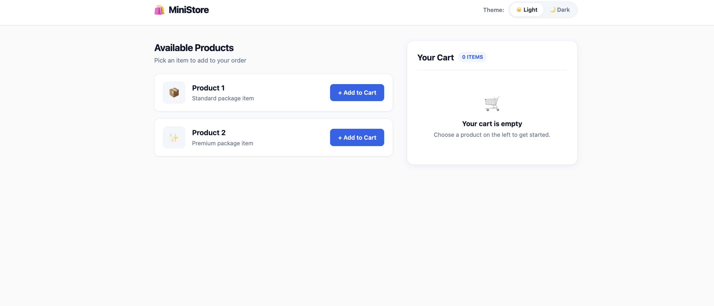
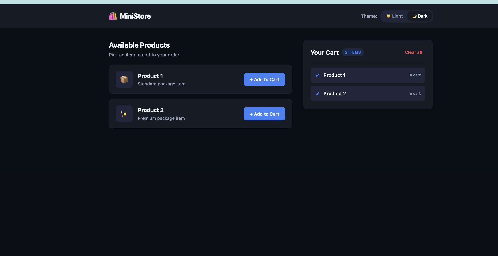

# Django Lab – Sessions and Cookies

## 📌 Lab Overview

This lab demonstrates how to use **Django Sessions** and **Cookies** in a simple shopping application.

The application allows the user to:

* Add products to a shopping cart.
* Store the cart using Django **sessions**.
* Clear the shopping cart.
* Switch between **Light** and **Dark** themes.
* Store the selected theme using a **cookie**.
* Keep the selected theme for **30 days**.

---

## 🖥️ Application Screenshots

### Light Theme – No Products

The application starts with the **Light theme** and an empty shopping cart.



### Dark Theme – Products Added

After switching to the **Dark theme** and adding products, the cart contains the selected products.



---

## 🛒 Shopping Cart Using Sessions

The shopping cart is stored in Django's session.

```python
def home(request):
    cart = request.session.get("cart", [])

    theme = request.COOKIES.get("theme", "light")

    return render(request, "home.html", {
        "cart": cart,
        "theme": theme,
    })
```

The cart is retrieved from the session using:

```python
request.session.get("cart", [])
```

If there is no cart yet, an empty list `[]` is used.

### Adding a Product

```python
def add_product(request, product_id):
    cart = request.session.get("cart", [])

    cart.append(product_id)

    request.session["cart"] = cart

    return redirect("home")
```

When the user adds a product:

1. The current cart is retrieved.
2. The product ID is added to the cart.
3. The updated cart is saved back to the session.
4. The user is redirected to the home page.

### Clearing the Cart

```python
def clear_cart(request):
    request.session.pop("cart", None)

    return redirect("home")
```

This removes the cart from the session.

---

## 🎨 Theme Using Cookies

The application uses a cookie to remember whether the user selected **Light** or **Dark** mode.

```python
theme = request.COOKIES.get("theme", "light")
```

If the `theme` cookie exists, its value is used.

If it does not exist, the application uses:

```text
light
```

as the default theme.

---

## 🔄 Changing the Theme

The theme is changed using the `set_theme` view:

```python
def set_theme(request, theme):
    # Only allow light or dark
    if theme not in ["light", "dark"]:
        theme = "light"

    response = redirect("home")

    # Save theme for 30 days
    response.set_cookie(
        "theme",
        theme,
        max_age=30 * 24 * 60 * 60
    )

    return response
```

The application only allows two theme values:

* `light`
* `dark`

The selected theme is stored in a cookie using:

```python
response.set_cookie()
```

The cookie is saved for **30 days**.

---

## 🧠 Sessions vs Cookies

| Feature          | Session                   | Cookie                  |
| ---------------- | ------------------------- | ----------------------- |
| Used for         | Shopping cart             | Theme                   |
| Example          | Product IDs               | `light` / `dark`        |
| Django code      | `request.session`         | `request.COOKIES`       |
| Saving data      | `request.session["cart"]` | `response.set_cookie()` |
| Used in this lab | Cart                      | Theme preference        |

---

## 📂 Main View Code

The complete `views.py` used in this lab is:

```python
from django.shortcuts import render, redirect


def home(request):
    cart = request.session.get("cart", [])

    theme = request.COOKIES.get("theme", "light")

    return render(request, "home.html", {
        "cart": cart,
        "theme": theme,
    })


def add_product(request, product_id):
    cart = request.session.get("cart", [])

    cart.append(product_id)

    request.session["cart"] = cart

    return redirect("home")


def clear_cart(request):
    request.session.pop("cart", None)

    return redirect("home")


def set_theme(request, theme):
    # Only allow light or dark
    if theme not in ["light", "dark"]:
        theme = "light"

    response = redirect("home")

    # Save theme for 30 days
    response.set_cookie(
        "theme",
        theme,
        max_age=30 * 24 * 60 * 60
    )

    return response
```

---

## 🎯 Learning Objectives

After completing this lab, I learned how to:

* Use Django **sessions** to store temporary user data.
* Add and remove items from a session-based shopping cart.
* Use Django **cookies** to store user preferences.
* Read cookies using `request.COOKIES`.
* Create cookies using `response.set_cookie()`.
* Set an expiration time for cookies.
* Pass session and cookie data from a view to a template.
* Create a simple Light/Dark theme system.

---

## ✅ Result

The final application demonstrates two different ways of storing user-related data:

**Session → Shopping Cart**

**Cookie → Theme Preference**

The cart can contain products while the user's selected Light/Dark theme is remembered across visits.
