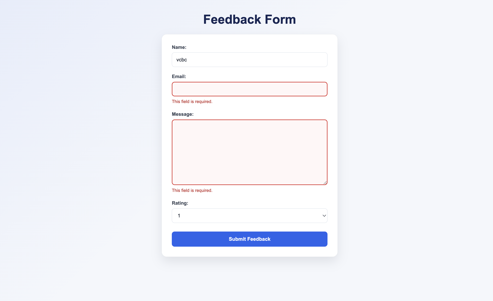

# Feedback Form

A simple Django feedback form that validates user input and redirects to a thank-you page after successful submission.

## Features

* Collects the user's **name**
* Collects the user's **email**
* Collects a **feedback message**
* Requires the message to be at least **20 characters**
* Allows the user to select a **rating from 1 to 5**
* Validates the form when submitted using `POST`
* Displays validation errors for incorrect inputs
* Highlights invalid fields with CSS
* Redirects to a **Thank You** page after successful submission
* Uses a separate static CSS file

## Form Validation

The form validates:

| Field   | Validation              |
| ------- | ----------------------- |
| Name    | Maximum 100 characters  |
| Email   | Must be a valid email   |
| Message | Minimum 20 characters   |
| Rating  | Must be between 1 and 5 |

## How It Works

When the user opens the feedback page with a `GET` request, an empty form is displayed.

When the user submits the form with a `POST` request:

1. Django receives the submitted data.
2. The `FeedbackForm` validates the inputs.
3. If the inputs are invalid, error messages are displayed and invalid fields are highlighted.
4. If all inputs are valid, the user is redirected to the `thank_you` page.

## Project Structure

```text
project/
│
├── app/
│   ├── forms.py
│   ├── views.py
│   ├── urls.py
│   │
│   ├── templates/
│   │   ├── feedback.html
│   │   └── thank_you.html
│   │
│   └── static/
│       └── css/
│           └── style.css
│
├── manage.py
└── project/
    └── settings.py
```

## Technologies Used

* Python
* Django
* HTML
* CSS

## Screenshots

### Incorrect Inputs

The form displays validation errors and highlights the incorrect fields.



### Thank You Page

After submitting valid feedback, the user is redirected to the thank-you page.


Polish the README further

* Add a project overview section
* Add setup and run instructions
