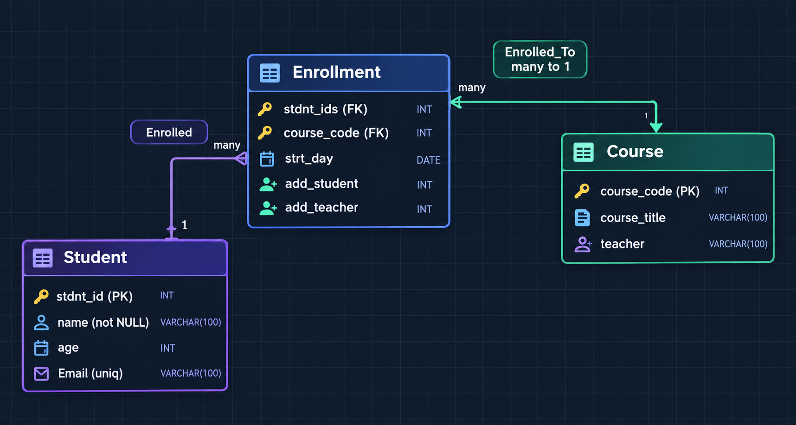

# Database ER Diagram Lab

This lab focuses on designing an **Entity-Relationship (ER) diagram** for a simple student enrollment system. The diagram represents how students, courses, and enrollments are connected in a relational database.

## ER Diagram



## 1. Student

The **Student** entity stores information about each student.

* `stdnt_id` — **Primary Key (PK)** that uniquely identifies each student.
* `name` — Student's name and cannot be empty (**NOT NULL**).
* `age` — Student's age.
* `email` — Student's email and must be unique (**UNIQUE**).

The primary key makes sure that every student can be identified individually.

## 2. Course

The **Course** entity stores information about available courses.

* `course_code` — **Primary Key (PK)** that uniquely identifies a course.
* `course_title` — The name/title of the course.
* `teacher` — The teacher assigned to the course.

## 3. Enrollment

The **Enrollment** entity represents a student's enrollment in a course.

It contains:

* `stdnt_id` — **Foreign Key (FK)** referencing the `Student` table.
* `course_code` — **Foreign Key (FK)** referencing the `Course` table.
* `strt_day` — The start/enrollment date.
* `add_student` — Used for adding a student to an enrollment.
* `add_teacher` — Used for adding a teacher.

The foreign keys connect the enrollment record to existing students and courses.

## 4. Relationships

### Student → Enrollment

A **Student can have many enrollments**, while each enrollment belongs to one student.

**1 Student → Many Enrollments**

For example:

```text
Student 001
   │
   ├── Enrollment 1
   ├── Enrollment 2
   └── Enrollment 3
```

### Course → Enrollment

A **Course can have many enrollments**, because many students can enroll in the same course.

**1 Course → Many Enrollments**

```text
Course C001
   │
   ├── Student 001
   ├── Student 002
   └── Student 003
```

Therefore, `Enrollment` acts as the table connecting **Student** and **Course**.

## 5. Keys and Constraints

The diagram also demonstrates common database constraints:

| Constraint   | Purpose                             |
| ------------ | ----------------------------------- |
| **PK**       | Uniquely identifies each record     |
| **FK**       | Connects records between tables     |
| **UNIQUE**   | Prevents duplicate values           |
| **NOT NULL** | Requires a value to be provided     |
| **CHECK**    | Ensures a value follows a condition |

For example, because `Enrollment.stdnt_id` is a foreign key, an enrollment **cannot reference a student that does not exist**.

```text
Student
stdnt_id = 999 ❌ does not exist

Enrollment
stdnt_id = 999 ❌ invalid
```

This helps maintain **data integrity** in the database.

## What This Lab Demonstrates

This ER diagram demonstrates:

* Entity identification
* Primary and foreign keys
* One-to-many relationships
* Associating students with courses
* Database constraints
* Referential integrity
* Basic relational database design
